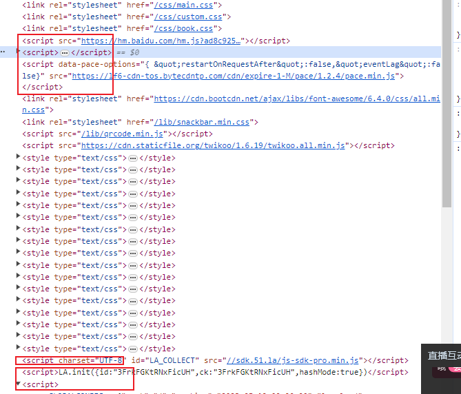

# JS模块化

## 1、why模块化

在原来的开发中，我们一个HTML文件往往会引入无数多个js文件，例如这样



而在JS中，声明的变量往往是全局变量，项目中的JS文件可能是多个人开发的，比如你的同事。多个JS文件中可能就会存在变量名字重复从而导致GLOBAL全局污染，出现不可预料的问题。

## 2、简单的模块化

利用闭包，IIFE实现模块化

```html
<!DOCTYPE html>
<html lang="en">
<head>
    <meta charset="UTF-8">
    <meta http-equiv="X-UA-Compatible" content="IE=edge">
    <meta name="viewport" content="width=device-width, initial-scale=1.0">
    <title>Document</title>
</head>
<body>
    <script>
        // 使用立即执行函数实现模块化
        (function(){
            var msg = 'Hello JsModule'
            function sayHello(){
                console.log('Hi' + msg)
            }
            function sayOther(){
                console.log('Other' + msg)
            }
            window.Module = {
                sayHello: sayHello,
                sayOther: sayOther
            }
        })()
    </script>
    <script>
        Module.sayHello()
        Module.sayOther()
    </script>
</body>
</html>
```

> 缺陷：
>
> ​	1、模块依然挂载在window上，依旧可能会造成全局污染
>
> ​	2、模块之间可能存在依赖关系，<mark>而且对依赖关系的先后顺序很重要</mark>

## 3、CommonJS

相关博客：[https://www.cnblogs.com/jzhishu/p/13599570.html](https://www.cnblogs.com/jzhishu/p/13599570.html)

nodejs采用的模块化标准，commonjs使用方法**require**来引入模块,这里require()接收的参数是<mark>模块名或者是模块文件的路径</mark>，如果是模块名的话，require会到node_modules中去找对应名称的模块来加载

```js
const _ = require("lodash");
```

这里就引入了一个名为lodash的模块，那么一个模块应该如何对外提供接口呢？
commonjs提供两种方式对外暴露接口

```js
// 第一种module.exports
const name = "张三";
module.exports = {
    getName(){
        return name
    }
}

// 第二种
const name = "张三"
module.exports.getName = function(){
    return name;
}

// 第三种(简写方式)
const name = "张三"
exports.getName = function(){
    return name;
}
```

其实本质上，模块对外暴露的就是exports这个对象，*module.exports =*这种写法，相当于直接给exports对象赋值，而*module.exports. name*这种写法其实就是给exports对象上添加了一个名为"getName"的方法。

示例：

```js
// module2.js
let count = 1;

let m2 = function(){
    console.log("m2fun()")
}

module.exports = {
    count,
    // m2
}
module.exports.m2 = m2
```

```js
// module1.js
const m2 = require('./module2.js')

console.log(m2.count)
m2.m2()

let m1 = function(){
    console.log('m1fun()')
}

module.exports = {
    m1
}
```

```js
// app.js
const m1 = require('./module1.js')
m1.m1()
```

```shell
// 运行app.js的结果
1
m2fun()
m1fun()
```

**require('')相当于直接运行了这个文件**

<mark>一个文件统一导出方式注意点</mark>：

> 1、在一个文件中<mark>不能</mark>多次  module.exports ，原因很简单，后面的exports会覆盖前面的exports
>
> 2、在一个文件中可以多次  module.exports.name或者exports. name  ， 因为这是在给exports的对象 添加键值对

<mark>一个文件混合导出方式注意点</mark>：

> 1、在一个文件中多次module.exports.name或者exports. name之后，不能再module.exports={}，因为直接赋值对象会把前面的所有覆盖
>
> 2、在module.exports={}之后，<mark>不能使用简写方式</mark> exports.name，但是<mark>可以使用</mark>module.exports.name 【原因下面讲解】

在CommonJS规范中，你可以理解为了使用者方便简写，ComonJs会在每一个文件最上面添加这样的代码：

```js
module.exports = {};//方便理解 一开始是空对象
let exports = module.exports;
console.log(module.exports===exports)//true
```

在JS中，对象类型的赋值都是<mark>赋的内存地址</mark>，所以当你重新给module.exports赋值对象的时候，相当于切断了exports和module.exports的联系。


CommonJs在浏览器端不能使用，因为不支持require语法，但是能使用browserify编译，具体使用请搜索browserify，[参考地址https://ruanyifeng.com/blog/2015/05/commonjs-in-browser.html](https://ruanyifeng.com/blog/2015/05/commonjs-in-browser.html)

## 4、AMD（RequireJS）

AMD是专门为浏览器端提供的模块化，异步

略，详情自己Google

## 5、CMD

CMD也是专门为浏览器端提供的模块化，异步

略，详情自己Google

## 6、ES6

es6提出了新的模块化方案，这个方案应该也是现在最流行的。通过关键字export value来暴露模块，通过import moduleName from path来引入模块,是不是看起来很简单？但是其实这里还有很多细节

> 浏览器端是不能直接运行的，需要先用babel将es6语法转译成es5（把import转译成了require），然后再使用打包工具打包，最后在页面中引入

### 多次暴露

```js
// moduleA.mjs
// 暴露一个变量
export let name = "张三"

// 暴露一个方法
export function getName(){
    return name;
}

export function setName(newName){
    name = newName;
}

// main.mjs
import {name, getName, setName} from "./moduleA";

console.log(name); // 张三
setName("李四");
console.log(getName()); // 李四
```

这种方式在import时只能用**解构赋值**，使用下面的方式，会输出undefined

```js
import moduleA from "./moduleA"

console.log(moduleA); // undefined;在node环境下运行会报错
```

那如果模块分别暴露的方法有很多怎么办呢，这时候结构赋值不是要写很多个方法？其实还可以这样引入

```js
import * as moduleA from "./moduleA";

console.log(moduleA.name); // 张三
moduleA.setName("李四");
console.log(moduleA.getName()); // 李四
```

### 默认暴露

es6还提供了一种暴露方法叫默认暴露，默认暴露即export default value这里的value可以是任何值。这种方式在import时可以直接赋值一个整体对象。

```js
// moduleA.mjs
export default {
    name : 张三,
    setName(newName){
        this.name = newName;
    },
    getName(){
        return this.name;
    }
}

// main.mjs
import moduleA from "./moduleA"

console.log(moduleA);  // { name: '张三', setName: [Function: setName], getName: [Function: getName] }
```

