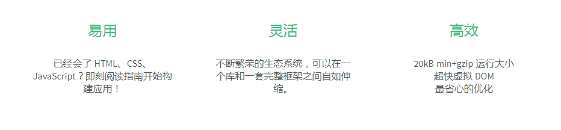
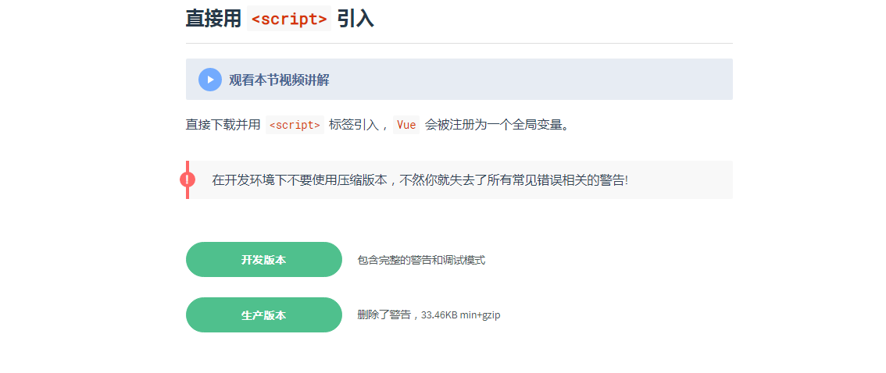
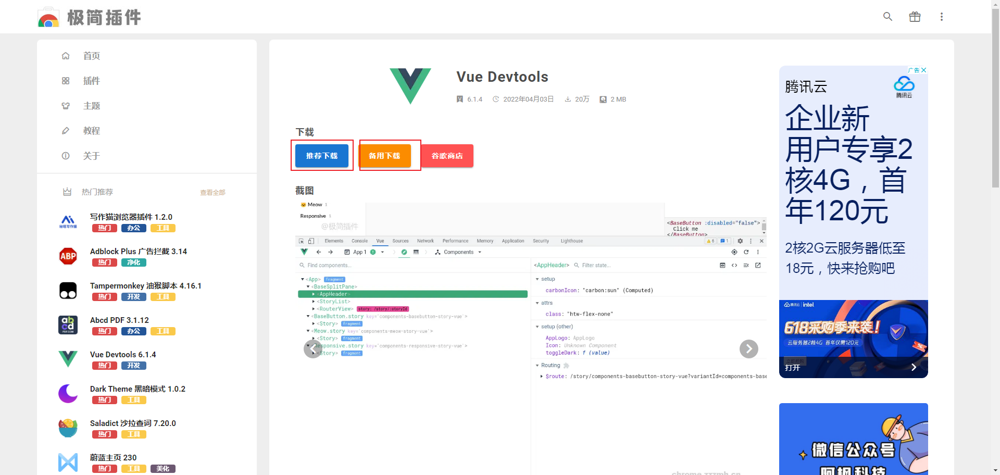
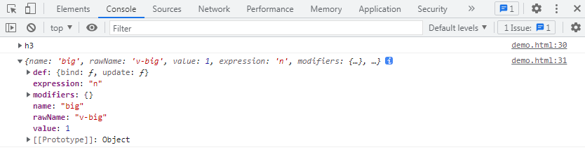
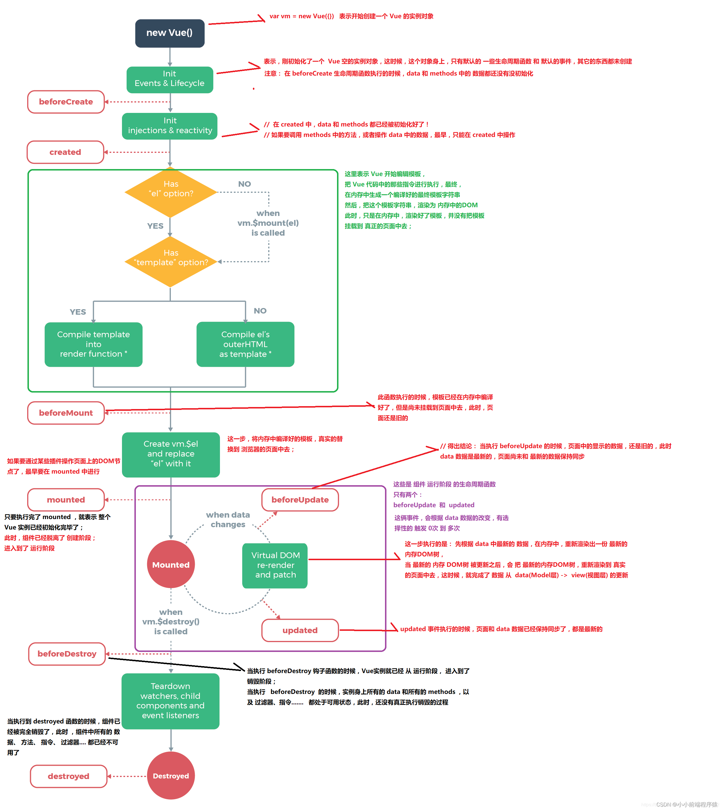
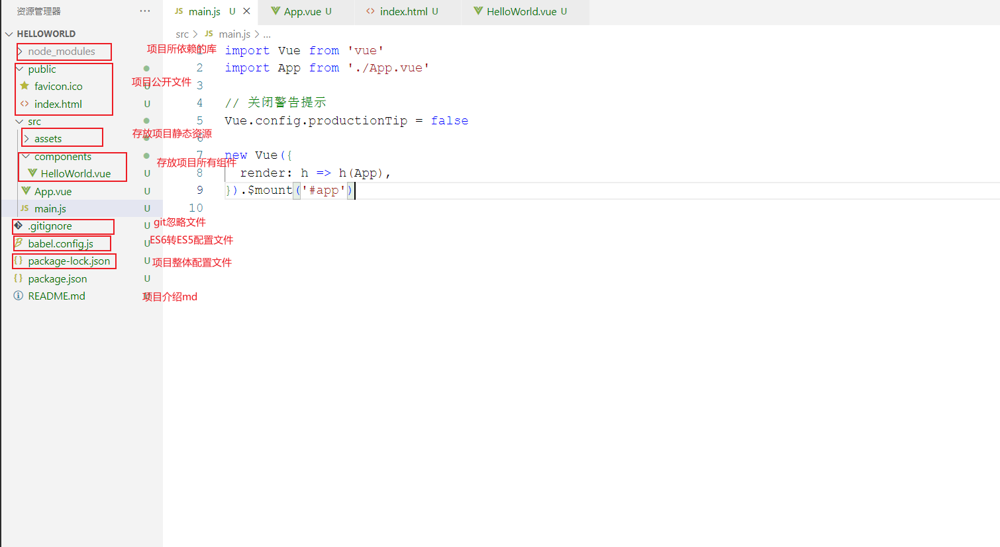
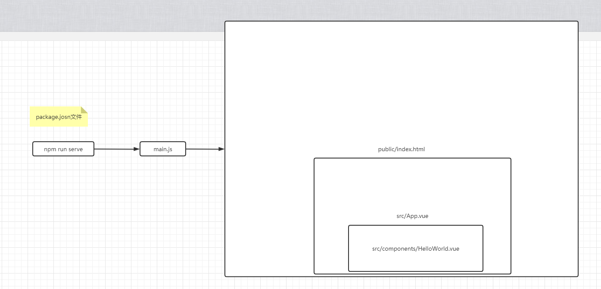
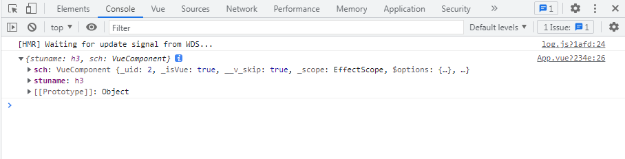
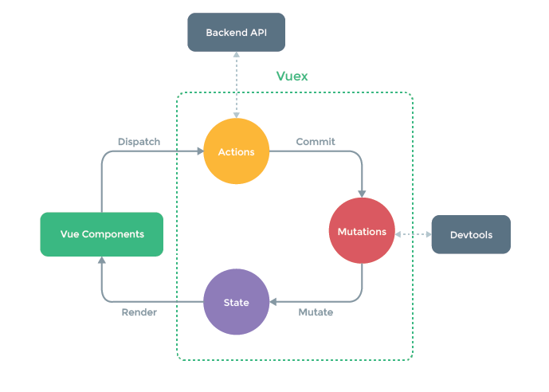

# Vue2学习笔记

## 1.Vue概念

vue是一款友好的、多用途的且高性能的js框架，它可以帮你创建可维护性和可测试性更强的代码库。 轻量级js框架



## 2.Vue初体验

我们不推荐新手直接使用Vue-cli脚手架。而是像我们原始js一样，在html通过标签引用

两种方式：

一、引入网络在线js

```html
<!-- 开发环境版本，包含了有帮助的命令行警告 -->
<script src="https://cdn.jsdelivr.net/npm/vue@2/dist/vue.js"></script>
```

二、将vue.js下载下来，引入本地地址

找到vue官网，下载vue。

Vue包含两个版本，开发版本和生产版本。

开发版本：内容更多，包含开发时的警告和调式模式。

生产版本：内容相对较少，删除了警告。



```html
<!-- 引入本地js -->
<script src="../vue.js"></script>
```

### 2.1Vue的Hello World案例

```html
<!DOCTYPE html>
<html lang="en">
<head>
    <meta charset="UTF-8">
    <meta http-equiv="X-UA-Compatible" content="IE=edge">
    <meta name="viewport" content="width=device-width, initial-scale=1.0">
    <title>初始Vue</title>
    <script src="../vue.js"></script>
</head>
<body>
    <div id="app">
        <p>{{msg}}</p>
    </div>
    <script>
        const vm = new Vue({
            el: "#app",
            data: {
                msg: "helloworld"
            }
        });
    </script>
</body>
</html>
```

### 2.2Vue插件 devtools

官方推荐使用Vue开发时安装devtools能更加方便快捷的管理Vue状态

百度搜索“极简插件”，进去之后搜“vue devtools”



### 2.3Vue案例分析

```html
<!DOCTYPE html>
<html lang="en">
<head>
    <meta charset="UTF-8">
    <meta http-equiv="X-UA-Compatible" content="IE=edge">
    <meta name="viewport" content="width=device-width, initial-scale=1.0">
    <title>初始Vue</title>
    <script src="../vue.js"></script>
</head>
<body>
    <div id="app">
        <p>{{msg}}</p>
    </div>
    <script>
        const vm = new Vue({
            el: "#app",
            data: {
                msg: "helloworld"
            }
        });
    </script>
</body>
</html>
```

el：表示要挂载的容器，使用选择器，接管所选择的容器。所挂载的容器也叫Vue模板。

data：Vue所包含的数据。暂时写成对象，后面会写成函数。

{{}}：插值表达式，能访问到data里面的数据

## 3.Vue常用模板指令

### 3.1文本相关指令

##### v-text：用于渲染普通文本，不能识别html标签

```html
<div id="app">
    <p v-text="msg"></p>
</div>
<script>
    const vm = new Vue({
        el: "#app",
        data: {
            msg: "helloworld"
        }
    });
</script>
```

##### v-html：用于渲染普通文本，能识别html标签

```html
<div id="app">
    <p v-html="msg"></p>
</div>
<script>
    const vm = new Vue({
        el: "#app",
        data: {
            msg: "<h5>helloworld</h5>"
        }
    });
</script>
```

##### {{}}：不能识别html标签

```html
<div id="app">
    <p>{{msg}}</p>
</div>
<script>
    const vm = new Vue({
        el: "#app",
        data: {
            msg: "helloworld"
        }
    });
</script>
```

总结：

1. **都能用于渲染文本**
2. **只有v-html能识别html标签**
3. **v-html、v-text都写在标签属性内 ，{{}}写在标签体内**

### 3.2属性绑定指令v-bind

##### v-bind：将属性动态绑定,简写冒号“：”

```html
<div id="app">
    <p v-bind:title="msg"></p>
    <!--简写:<p :title="msg"></p>  -->
</div>
<script>
    const vm = new Vue({
        el: "#app",
        data: {
            msg: "鼠标悬停展示"
        }
    });
</script>
```

3.3事件监听指令v-on

##### v-on：指定事件后的回调函数，简写“@”

回调函数需写在methods节点里面

```html
<div id="app">
    <p v-on:click="show">{{msg}}</p>
    <!--简写: <p @click="show">{{msg}}</p>-->
</div>
<script>
    const vm = new Vue({
        el: "#app",
        data: {
            msg: "点击弹窗"
        },
        methods: {
            show(event){
                console.log(event);
                alert("我是sb！！！")
            }
        }
    });
</script>
```

##### 事件传递参数

默认会有event参数，但是如果你显示传递参数后，event参数必须有占位符传参$event

```html
<div id="app">
    <p @click="show(msg,$event)">{{msg}}</p>
</div>
<script>
    const vm = new Vue({
        el: "#app",
        data: {
            msg: "helloworld"
        },
        methods: {
            show(msg,event){
                console.log(event);
                console.log(msg);
            }
        }
    });
</script>
```

##### 事件修饰

1. prevent：阻止默认事件

2. stop：阻止事件冒泡

3. once：事件只触发一次

4. capture：使用事件的捕获模式

5. self：只有event.target是当前元素时才触发操作

6. passive：事件的默认行为立即执行，无需等待事件回调执行完毕

```html
<div id="app">
    <a href="http://www.baidu.com" @click.prevent="show(msg,$event)">{{msg}}</a>
</div>
<script>
    const vm = new Vue({
        el: "#app",
        data: {
            msg: "helloworld"
        },
        methods: {
            show(msg,event){
                console.log(event);
                console.log(msg);
            }
        }
    });
</script>
```

### 3.4条件渲染指令v-if、v-show

v-if：控制元素是否显示的问题，值取决于boolean值

v-show：控制元素是否显示的问题，值取决于boolean值

```html
<div id="app">
    <p v-if="show">{{msg}}</p>
    <!-- <p v-show="show">{{msg}}</p> -->
</div>
<script type="text/javascript">
    const vm = new Vue({
        el: "#app",
        data: {
            msg: "helloworld",
            show: true
        }
    });
</script>
```

区别：

1. v-show底层是将元素的display设置成隐藏和显示，就是说隐藏后其实元素还在，只是看不到而已

2. v-if是把元素在页面彻底移除

**当然，v-if后面也能跟v-else-if和v-else，中间不允许被打断**

```html
<div id="app">
    <p v-if="show === 1">{{msg}}</p>
    <p v-else-if="show === 2">{{msg}}</p>
    <p v-else-if="show === 3">{{msg}}</p>
    <p v-else>{{msg}}</p>
</div>
<script type="text/javascript">
    const vm = new Vue({
        el: "#app",
        data: {
            msg: "helloworld",
            show: 1
        }
    });
</script>
```

**须知：**

**当判断过v-if成立之后，v-else-if不会再进入判断。**

**v-else不需要再写判断条件，就算写了也不生效，因为v-else就是当前面所有不成立的时候**

### 3.5循环渲染指令v-for

循环遍历数组：(p,index)其中p为循环的每一项数据，index为索引。

```html
<div id="app">
    <ul>
        <li v-for="(p,index) in persons" ::key="p.id">
            {{p.name}}--{{p.age}}
        </li>
    </ul>
</div>
<script type="text/javascript">
    const vm = new Vue({
        el: "#app",
        data: {
            persons: [
                {id:"01",name:"张三",age:18},
                {id:"02",name:"李四",age:19},
                {id:"03",name:"王五",age:10}
            ]
        }
    });
</script>
```

循环遍历对象：(val,key,index)其中val为对象的值，key为对象的键，index为对象的key值的索引。

```html
<div id="app">
    <ul>
        <li v-for="(val,key,index) in pageObject" :key="index">
            {{val}}--{{key}}--{{index}}
        </li>
    </ul>
</div>
<script type="text/javascript">
    const vm = new Vue({
        el: "#app",
        data: {
            pageObject:{
                pageNum: 1,
                pageSize: 10
            }
        }
    });
</script>
```

Vue规定在使用循环时，必须指定key属性，并且key属性的值必须时唯一的，而且不能是index索引。

如果不指定key属性，在页面上动态添加列表时，就会出现问题。

底层是虚拟DOM的diff对比算法，不指定的话会涉及到效率问题。

### 3.6数据双向绑定v-model

**v-model只能用于表单元素中,**与元素进行双向绑定，用户输入改变后，里面的值也会改变

```html
<div id="app">
    <input type="text" v-model="keyWord"/>
</div>
<script type="text/javascript">
    const vm = new Vue({
        el: "#app",
        data: {
            keyWord:""
        }
    });
</script>
```

### 3.7 v-cloak指令

当vue.js加载好了之后，vue会把v-cloak指令给移除，结合这个特征再配合css。能将网速慢的情况下的用户体验提升

如果没有v-cloak，用户将在延迟下直接看到{{msg}}

```html
<head>
    <meta charset="UTF-8">
    <meta http-equiv="X-UA-Compatible" content="IE=edge">
    <meta name="viewport" content="width=device-width, initial-scale=1.0">
    <title>v-cloak指令</title>
    <style>
        [v-cloak]{
            display: none;
        }
    </style>
</head>
<body>
    <div id="app">
        <h5 v-cloak>{{msg}}</h5>
    </div>
    <script src="../js/vue.js"></script>
    <script>
        const vm = new Vue({
            el:'#app',
            data: {
                msg:'hello world'
            }
        })
    </script>
</body>
```

### 3.8 v-once指令

与v-cloak一样，没有value值，作用是，只在vue初次渲染时读取值，一旦读取值后就变为静态内容

### 3.9 v-pre指令

作用是让vue跳过编译。不对他进行模板检查、编译等操作

## 4.Vue配置对象讲解

#### 4.1  el  : 挂载的容器

#### 4.2  data：Vue里面的数据

### 4.3  computed：计算属性

通常computed可以对data里面的属性进行计算，得到一个新的属性。计算属性与data里面的数据是动态绑定的（data数据一旦变化，计算属性也会变化）。

简写：只考虑读取计算属性

计算属性也会被挂载到Vue对象上，与data里面的数据一样，所以计算属性也能用于插值表达式中

```html
<div id="app">
    {{msgPlus}}
</div>
<script>
    const vm = new Vue({
        el: "#app",
        data: {
            msg: "helloworld"
        },
        computed: {
            msgPlus(){
                return this.msg + "plus";
            }
        }
    });
</script>
```

全部写法：计算属性会有getter、setter方法。可以在setter方法中实现对data数据的改变。（基本不用）

```html
<div id="app">
    {{msgPlus}}
</div>
<script>
    const vm = new Vue({
        el: "#app",
        data: {
            msg: "helloworld"
        },
        computed: {
            msgPlus: {
                get(){
                    return this.msg + "plus";
                },
                set(val){
                    this.msg = val;
                }
            }
        }
    });
</script>
```

### 4.4  Watch：监听属性

监听数据的变化，一旦数据发生变化，就发生某些操作。

handler：表示数据变化就要执行的函数，newval表示变化后的新值，oldval表示变化前的旧值

immediate：表示是否在页面初始化就执行监听，默认是false

deep：表示深度监听，可以监听一个对象中的某一个属性。

```html
<div id="app">
    <input type="text" v-model="username">
</div>
<script>
    const vm = new Vue({
        el: "#app",
        data: {
            username: ''
        },
        watch: {
            username: {
                handler(newval,oldval){
                    console.log('数据刷新');
                },
                // 是否立即触发，true表示触发
                immediate: true,
                // 深度监听
                deep: true
            }
        }
    })
</script>
```

### 4.5 Filter：过滤器

过滤器适合对简单的数据处理后要呈现的样子。

过滤器使用方法：在变量后面使用管道符，并且过滤器可设置参数，也可连续调用

如果在使用时不调用参数，默认会把管道符前面的作为参数，过滤器函数也可以自定义参数，自定义参数后，管道符前面的依旧作为第一个参数

过滤器也能使用在属性绑定上，但是不能使用在v-model中

可以设置全局过滤器

```html
<head>
    <meta charset="UTF-8">
    <meta http-equiv="X-UA-Compatible" content="IE=edge">
    <meta name="viewport" content="width=device-width, initial-scale=1.0">
    <title>过滤器使用</title>
    <script src="../js/vue.js"></script>
    <script src="https://unpkg.com/dayjs@1.8.21/dayjs.min.js"></script>
</head>
<body>
    <div id="app">
        <!-- 使用计算属性 -->
        <h3>{{timeh}}</h3>
        <!-- 使用方法 -->
        <h3>{{getTime()}}</h3>
        <!-- 使用过滤器 -->
        <h3>{{time | timeFormat}}</h3>
        <!-- 使用过滤器 -->
        <h3>{{time | timeFormat('YYYY-MM-DD') | split}}</h3>
        <h3 :title="time | timeFormat"></h3>
    </div>
    <script>
        // 全局过滤器
        Vue.filter('split',function(value){
            return value.slice(0,5);
        })
        const vm = new Vue({
            el:'#app',
            data: {
                time:'1657008423656'
            },
            computed:{
                timeh(){
                    return dayjs(this.time).format('YYYY-MM-DD HH:mm:ss');
                }
            },
            methods:{
                getTime(){
                    return dayjs(this.time).format('YYYY-MM-DD HH:mm:ss');
                }
            },
            filters:{
                timeFormat(value,str="YYYY年MM月DD HH:mm:ss"){
                    return dayjs(value).format(str);
                }
            }
        })
    </script>
</body>
```

### 4.6 directives自定义指令

Vue有许多内置指令，但是难免我们需要自定义指令去实现不同的需求。

##### 函数式写法，也是简写写法

```html
    <div id="app">
        <h3>值:{{n}}</h3>
        放大10倍的值:<h3 v-big="n"></h3>
        <button @click="add">+1</button>
    </div>
    <script>
        const vm = new Vue({
            el:'#app',
            data:{
                n:1
            },
            methods: {
                add(){
                    this.n++
                }
            },
            directives:{
                // 简写属性，也叫函数式写法
                big(el,binging){
                    console.log(el)
                    console.log(binging)
                    el.innerText = binging.value*10;
                }
            }
        })
    </script>
```



总结：（简写形式）

1. 指令在使用时用v-开头，但是在定义时只用写v-后面的

2. 指令书写在directives对象中

3. 两个参数，第一个参数代表指令所在的html元素，第二个参数代表指令本身的一些属性

4. 指令函数会在元素与指令成功绑定时调用，也会在模板重新渲染时调用

##### 对象式写法，也是全称写法

```html
<!-- 实现输入框一上来就聚焦 -->
    <div id="app">
        <input type="text" v-fbind:value="n"/>
        <button @click="add">+1</button>
    </div>
    <script>
        const vm = new Vue({
            el:'#app',
            data:{
                n:1
            },
            methods:{
                add(){
                    this.n++
                }
            },
            directives:{
                fbind:{
                    // 指令与标签成功绑定
                    bind(ele,binging){
                        ele.value = binging.value;
                    },
                    // 绑定成功后插入页面时
                    inserted(ele,binging){
                        ele.focus()
                    },
                    // 模板重新渲染时
                    update(ele,binging){
                        ele.value = binging.value;
                    }
                }
            }
        })
    </script>
```

对象式写法，能更精准控制指令执行时间节点

**细节：**

1. **指令如果有多个单词，使用-短横线分隔，不要使用驼峰命名**

## 5.Vue实用小技巧（重点）

### 5.1v-model应对不同的表单元素

案例：

```html
<div id="app">
        <form @submit.prevent="demo">
            账号：<input type="text" name="username" v-model.trim="userInfo.username"/><br/>
            密码：<input type="password" name="password" v-model="userInfo.password"/><br/>
            年龄：<input type="number" name="age" v-model.number="userInfo.age"/><br/>
            性别：男<input type="radio" name="sex" v-model="userInfo.sex" value="man"/>
                 女<input type="radio" name="sex" v-model="userInfo.sex" value="woman"/><br/>
            爱好：洗澡<input type="checkbox" name="hobby" value="洗澡" v-model="userInfo.hobby"/>
                 洗碗<input type="checkbox" name="hobby" value="洗碗" v-model="userInfo.hobby"/>
                 洗衣服<input type="checkbox" name="hobby" value="洗衣服" v-model="userInfo.hobby"/><br/>
            区域：
                <select v-model="userInfo.city">
                    <option value="">请选择</option>
                    <option value="beijing">北京</option>
                    <option value="shanghai">上海</option>
                    <option value="nanjing">南京</option>
                </select>
                <br/>
            介绍:
                <textarea v-model.lazy="userInfo.tro"></textarea><br/>
            <input type="checkbox" v-model="userInfo.agree"/>同意此<a href="">协议</a>
            <button>提交</button>
        </form>
    </div>
    <script>
        const vm = new Vue({
            el:'#app',
            data: {
                userInfo:{
                    username:'',
                    password:'',
                    age:'',
                    sex:'man',
                    hobby:[],
                    city:'',
                    tro:'',
                    agree: false
                }
            },
            methods:{
                demo(){
                    console.log(this.userInfo);
                }
            }
        })
    </script>
```

###### 细节分析

1. v-model默认收集的是表单元素的value值，所以text和password的value
2. 当设置在radio上时，必须设置value值，否则不能收集
3. 当设置在checkbox上时，不设置value值，收集到的是boolean值，就是是否勾选

	设置了value值，还必须将绑定的数据类型是数组类型

 4. v-model修饰符：

    lazy：当元素失去焦点时，才同步数据

    number：将收集到的值转换成number类型

    trim：去除首尾的空格
    

## 6.Vue生命周期

与人类相同，Vue也有生命。Vue生命周期就是指从new Vue开始到Vue实例销毁的一系列过程。钩子函数指的是在Vue的生命周期中关键点所执行的回调函数。



```html
<template>
  <div id="app">
    <span :model="msg"></span>
  </div>
</template>

<script>
export default {
  name: 'App',
  data() {
    return {
      msg: 'msg',
    }
  },
  beforeCreate() {
    console.log('----beforeCreate----')
    console.log(this.msg) //msg
    console.log(this.$el) //undefined
  },
  created() {
    console.log('----created----')
    console.log(this.msg)
    console.log(this.$el)
  },
  beforeMount() {
    console.log('----beforeMount----')
    console.log(this.msg)
    console.log(this.$el)
  },
  mounted() {
    console.log('----mounted----')
    console.log(this.msg)
    console.log(this.$el)
  },
}
</script>
```

## 7.组件化编程

当页面中的内容过多，组件化可以将页面中的html、css、js抽离出来，形成一个个组件，达到复用的概念。

### 7.1非单文件组件

非单文件组件：一个页面包含n个组件

案例：

```html
    <div id="app">
         <!-- 3.使用组件 -->
        <school></school>
        <student></student>
        <hello></hello>
    </div>
    <script>
        const hello = Vue.extend({
            name:'hello',
            template:`
                <div>
                    <h1>hello</h1>    
                </div>
            `,
        })
        // 全局注册
        Vue.component('hello',hello);

        // 1.定义组件
        const school = Vue.extend({
            name:'school',
            template:`
                <div>
                    <h3>{{name}}</h3>
                    <h4>{{add}}</h4>   
                </div>
            `,
            data(){
                return {
                    name:'武侯区',
                    add:'丰德广场'
                }
            }
        })
        // 1.定义组件
        const student = Vue.extend({
            name:'student',
            template:`
                <div>
                    <h3>{{name}}</h3>
                    <h4>{{age}}</h4>   
                </div>
            `,
            data(){
                return {
                    name:'张三',
                    age:'18'
                }
            } 
        })

        new Vue({
            el:'#app',
            // 2.局部注册组件
            components:{
                school,
                student
            }
        })
    </script>
```

这种方式并不常用。

组件使用步骤：

1. 使用Vue.extend({})，可以定义一个组件

2. 分为局部注册和全局注册。

   局部注册指的是只能在当前Vue实例中使用，在Vue配置对象中声明components节点对象

   ```js
   new Vue({
               el:'#app',
               // 2.局部注册组件
               components:{
                   school,
                   student
               }
           })
   ```

   全局注册后，所有Vue实例都能使用，

   ```js
   // 全局注册
   Vue.component('hello',hello);
   ```

	3.使用组件，像使用html标签一样就可以了

```html
<!-- 3.使用组件 -->
<school></school>
<student></student>
<hello></hello>
```

###### 细节补充

1. 当组件名为多个字母时，可以使用-短横线分隔，也可以使用大驼峰命名（只能在脚手架环境中）
2. 使用组件时可以双标签，也可以单标签（只能在脚手架环境中）
3. const vv  =  Vue.extend({})  可以简写成 const vv = {},  Vue会自动帮你执行Vue.extend()

### 7.2单文件组件

单文件组件：一个页面只包含一个组件（文件以vue结尾）（后面常用）

```vue
<template>
// 页面样式，必须有一个根元素
</template>
<script>
    export default {
        name:'School',
        data(){
            return {
                
            }
        },
        methods:{
            
        }
    }
</script>
<style>
    // 页面的样式
</style>
```

## 8.脚手架Vue-cli

### 8.1脚手架搭建步骤

1.全局安装Vue-Cli

```shell
npm install -g '@vue/cli@4.0.5'
```

2.创建Vue项目

```shell
vue create 你的项目名
```

### 8.2项目结构分析



### 8.3运行package.json中的npm run serve执行流程

 **1.运行package.json中的npm run serve命令**

```js
  "name": "helloworld",
  "version": "0.1.0",
  "private": true,
  "scripts": {
    "serve": "vue-cli-service serve",
    "build": "vue-cli-service build",
    "lint": "vue-cli-service lint"
  },
```

**2.找到src/main.js（为什么会去找这个后面讲）**

```js
import Vue from 'vue'
import App from './App.vue'

// 关闭警告提示
Vue.config.productionTip = false

new Vue({
  render: h => h(App),
}).$mount('#app')
```

引入Vue和App.vue，将Vue挂载到#app上，render为输出内容到#app模板上

public/index.html

```html
<!DOCTYPE html>
<html lang="">
  <head>
    <meta charset="utf-8">
    <meta http-equiv="X-UA-Compatible" content="IE=edge">
    <meta name="viewport" content="width=device-width,initial-scale=1.0">
    <link rel="icon" href="<%= BASE_URL %>favicon.ico">
    <title><%= htmlWebpackPlugin.options.title %></title>
  </head>
  <body>
    <noscript>
      <strong>We're sorry but <%= htmlWebpackPlugin.options.title %> doesn't work properly without JavaScript enabled. Please enable it to continue.</strong>
    </noscript>
    <div id="app"></div>
    <!-- built files will be auto injected -->
  </body>
</html>
```

对，你猜的没错，上面的$mount('#app')就是挂载到这里的div id="app"

为什么会出现render函数呢？也不是之前的template？

因为上面的import Vue from 'vue'  引入的Vue并不是完整版，里面并不包含template解析器。

而使用render能将页面输出到app中。

```js
new Vue({
  el:'#app',
  // render: h => h(App),
  render: function(createElement){
    return createElement('h1','nihao')
  }
})
```

本质上render是一个函数，接受一个函数型参数，函数有返回值，返回什么，页面就呈现什么

createElement('h1','nihao')这句话相当于《h1》nihao《/h1》

所以页面呈现nihao的一级标题。

那么把render简写成lambada表达式不就是render: h => h(App)。

### 8.4Vue.config.js配置文件

为什么我运行npm run serve它就会去找main.js呢，为什么我没有说去找index.html去作为主界面啊？

其实vue脚手架也是基于webpack的，只不过它隐藏了webpack相关信息。

使用vue inspect > output.js能把所有的webpack配置输出到output.js中

```shell
vue inspect > output.js
```

如果我们要修改这个配置，可以在官网找到vue.config.js文件

放到我们的根目录下，与我们的package.json在同一目录下

```js
module.exports = {
  pages: {
    index: {
      // page 的入口
      entry: 'src/index/main.js',
      // 模板来源
      template: 'public/index.html',
      // 在 dist/index.html 的输出
      filename: 'index.html',
      // 当使用 title 选项时，
      // template 中的 title 标签需要是 <title><%= htmlWebpackPlugin.options.title %></title>
      title: 'Index Page',
      // 在这个页面中包含的块，默认情况下会包含
      // 提取出来的通用 chunk 和 vendor chunk。
      chunks: ['chunk-vendors', 'chunk-common', 'index']
    },
    // 当使用只有入口的字符串格式时，
    // 模板会被推导为 `public/subpage.html`
    // 并且如果找不到的话，就回退到 `public/index.html`。
    // 输出文件名会被推导为 `subpage.html`。
    subpage: 'src/subpage/main.js'
  }
}
```

## 9.Ref属性

Vue官方不推荐操作Dom元素，但是有时候不得不使用Dom元素，Vue为了简化获取Dom节点的操作，有了Ref属性

```vue
<template>
  <div id="app">
    <h3 ref="stuname">姓名：{{name}}</h3>
    <h3>年龄：{{age}}</h3>
    <School ref="sch"></School>
    <button @click="demo">点击提示</button>
  </div>
</template>

<script>
import School from './components/School.vue'
export default {
  name: 'App',
  components: {
    School
  },
  data(){
    return {
      name:'张三',
      age:'18'
    }
  },
  methods:{
    demo(){
      // 获取dom节点
      console.log(this.$refs)
    }
  }
}
</script>
```



###### 细节补充

1. 给挂上ref属性后，该元素就会挂载到当前组件实例的$refs上。可以通过this.refs获取到dom元素
2. **如果是html标签，那么就是dom元素，如果是组件标签，获取到的是该组件的vc组件实例。（后面可以涉及到父子组件交互，拿到子组件的数据、函数）**

## 10.Vue配置对象补充Props

props用于  调用子组件时，接受参数。

props里面的属性与data一样，被挂载到组件实例上，但是props里面的属性不能被更改

父组件：

```vue
<template>
  <div id="app">
    <School :msg="message"></School>
  </div>
</template>

<script>
import School from './components/School.vue'
export default {
  name: 'App',
  data(){
    return {
      message:'你好哦哦哦'
    }
  },
  components: {
    School
  }
}
</script>
```

子组件：

```vue
<template>
  <div>
    <h4>学校:{{name}}</h4>
    <h4>地址:{{address}}</h4>
    <h5>{{msg}}</h5>
  </div>
</template>

<script>
export default {
    name:'school',
    // props:['msg'] 简写方式
    props:{
        msg:{
            type:String,
            require:false,
            default:'你好!'
        }
    },
    data(){
        return {
            name:'四川信息工大',
            address:'成都武侯区'
        }
    }
}
</script>
```

type：传递类型

require：是否必传

default：如果不传递参数，默认就是这个

## 11.mixin混合（混入）

Vue使用组件化的思想，将页面达到复用。mixin就是把组件里面的配置抽取出来也达到复用的地步。

### 11.1局部注册mixin

当2个组件拥有一些相同的配置时，mixin的作用就来了

a.vue

```vue
<template>
  <div>
    <h1>{{name}}</h1>
    <button @click="change">提示</button>
  </div>
</template>

<script>
import {a} from '../mixin'
export default {
    name:'AA',
    data(){
        return {
            name:'张三'
        }
    },
    mixins:[a]
}
</script>
```

b.vue

```vue
<template>
  <div>
    <h1>{{name}}</h1>
    <button @click="change">提示</button>
  </div>
</template>

<script>
import {a} from '../mixin'
export default {
    name:'BB',
    data(){
        return {
            name:'李四'
        }
    },
    mixins:[a]
}
</script>
```

minix.js

```js
const a = {
    methods:{
        change(){
            alert(this.name)
        }
    }
}
export {a}
```

### 11.2全局注册mixin

在main.js中

```js
import Vue from 'vue'
import App from './App.vue'
import {a} from './mixin'
// 关闭警告提示
Vue.config.productionTip = false
Vue.mixin(a)
new Vue({
  el:'#app',
  render: h => h(App),
})
```

## 12.Vue技巧总结（重要）

#### 12.1组件之间相互通信技巧

##### 1.父组件向子组件通信

父组件向子组件传递，利用props就能直接实现。props传递过来的数据不能被改变。（略）直接看 [Ctrl点击props跳转](#10.Vue配置对象补充Props)

也可以利用Ref属性，得到子组件的组件实例（数据和函数都能拿到）(略)直接看[ref属性](#9.Ref属性)

##### 2.子组件向父组件通信

子组件向父组件通信需要利用到组件实例的$emit。（其实这种方式是bus消息总线的一种特殊方式）

案例：

子组件

```vue
//子组件
<template>
  <div>
    <div v-for="(item, index) in articles" :key="index" @click="emitIndex(index)">{{item}}</div>
  </div>
</template>

<script>
export default {
  props: ['articles'],
  methods: {
    emitIndex(index) {
      this.$emit('onEmitIndex', index) // 触发父组件的方法，并传递参数index
    }
  }
}
</script>
```

父组件

```vue
// 父组件
<template>
  <div class="section">
    <com-article :articles="articleList" @onEmitIndex="EmitIndex"></com-article>此处@onEmitIndex="EmitIndex"在绑定函数
    <p>{{currentIndex}}</p>
  </div>
</template>

<script>
import comArticle from './test/article.vue'
export default {
  name: 'comArticle',
  components: { comArticle },
  data() {
    return {
      currentIndex: -1,
      articleList: ['红楼梦', '西游记', '三国演义']
    }
  },
  methods: {
      // 接受子组件数据回调函数
    EmitIndex(idx) {
      this.currentIndex = idx
    }
  }
}
</script>
```

##### 3.两个 有关系、没有关系的组件（兄弟组件，爷孙组件、父子组件）通信

bus消息总线不仅仅适用于两个有关系的组件、没有关系的组件也同样适用

消息总线的本质是，把事件的绑定和事件的监听都给一个第三方的Vue实例，利用这个Vue实例来实现监听

消息总线bus.js：

```js
// event-bus.js

import Vue from 'vue'
export const EventBus = new Vue()
```

两个兄弟组件：

```vue
<template>
  <div>
    <first-com></first-com>
    <second-com></second-com>
  </div>
</template>

<script>
import firstCom from './firstCom.vue'
import secondCom from './secondCom.vue'
export default {
  components: { firstCom, secondCom }
}
</script>
```

接受事件(触发事件)：

```vue
<template>
  <div>
    <button @click="add">加法</button>    
  </div>
</template>

<script>
import {EventBus} from './event-bus.js' // 引入事件中心

export default {
  data(){
    return{
      num:0
    }
  },
  methods:{
    add(){
      EventBus.$emit('addition', {
        num:this.num++
      })
    }
  }
}
</script>
```

发送事件(绑定事件)：

```vue
<template>
  <div>求和: {{count}}</div>
</template>

<script>
import { EventBus } from './event-bus.js'
export default {
  data() {
    return {
      count: 0
    }
  },
  mounted() {
    EventBus.$on('addition', param => {
      this.count = this.count + param.num;
    })
  }
}
</script>
```

## 13.Vue.nextTick 在Dom更新后执行回调函数

我们有些时候，会在更改某些数据之后（视图还未更新），操作这个数据，这个时候会操作失败，因为视图还未更新，这个时候使用Vue.nextTick就能避免这个问题。Vue.nectTick会在下一次Dom更新后执行函数。

案例：输入框显示的时候自动获取焦点

```vue
<template>
<div class="container">
    <button @click="change">xianshi</button>
    <input v-show="isShow" type="text" ref="input"/>
</div>
</template>

<script>
export default {
    name:'Test',
    data(){
        return {
            isShow: false
        }
    },
    methods:{
        change(){
            this.isShow = !this.isShow;
            this.$nextTick(() => {
                this.$refs.input.focus();
            })  
        }
    }
}
</script>

<style scoped>
.container{
    width: 200px;
    margin: 100px auto;
    box-sizing: border-box;
}
</style>
```

## 14.Vue配置代理

Vue-cli配置代理官网介绍https://cli.vuejs.org/zh/config/#devserver-proxy

当我们前后端分离之后，前端和后端并不在一个服务器上，这时候会出现（浏览器同源策略）跨域问题

方式一：（简写）利用Vue-cli的配置，在本地开启一个代理服务器，请求到达代理服务器之后转发给真实访问地址。

在vue.config.js中

```js
module.exports = {
    pages: {
      index: {
        // page 的入口
        entry: 'src/index/main.js',
      },
    },
    lintOnSave:false,//关闭语法检查
    devServer: {
      proxy: 'http://localhost:4000'
    }
}
```

http://localhost:4000 代表真实服务地址

**注意：（缺点）**

1. **所有在项目发送的请求，如果在本地找不到，那么就会找代理服务器。**
2. **不能配置多个代理，只能配置这一个。**
3. **所有请求都会走代理**

方式二：其实是方式一的全写

```js
module.exports = {
  devServer: {
    proxy: {
      '/api': {
`           target: 'http://localhost:4000',
            ws: true,
            changeOrigin: true,
            pathRewrite:{'^/api':''}`
      	},
      '/path'：{
        	target:'http://localhost:5001'
    	}
    }
  }
}
```

- 只要有	'/api'	的路径才决定 走代理 ，不写	‘/api’	就不走代理
- ws：表示websocket也进行代理
- changeOrigin：表示是否欺骗真实服务器。欺骗服务器请求方的地址。
- pathRewrite：重写URL地址，将/api开头的替换成空格。

## 15.Vue插槽

插槽用于在封装组件中，组件中的部分内容由使用者决定（可以是html，也可以是组件），由使用者决定的部分内容（组件不确定的内容）就叫插槽。

### 15.1简单插槽

vue插槽使用slot标签，使用者在组件的标签内定义使用。slot标签在页面上没有任何表现，只是替换内容。

子组件：

```vue
<template>
    <div class="soncontianer">
        <slot></slot>
    </div>
</template>

<script>
    export default {
        name:'Son',
    }
</script>
```

父组件：

```vue
<template>
  <div id="app">
    <Son>这是插槽内容</Son>
  </div>
</template>

<script>
import Son from './components/Son.vue'

export default {
  name: 'App',
  components: {
    Son
  }
}
</script>
```

《slot》标签会把使用组件时标签内的内容替换到slot的身上。

### 15.2具名插槽

具名插槽，顾名思义就是带有名字的插槽。想想当组件中有多个插槽时，我怎么知道你的多个内容分别对应那个插槽呢？

**vue2.6版本及之后：定义插槽时，通过name属性指定名称。使用插槽时，用template标签包裹要定义的内容，并用v-slot属性指定具名插槽  (v-slot可以简写#号)**

**vue2.6版本之前：定义插槽时，通过name属性指定名称。使用插槽时，在html标签中使用slot属性去选择不同的插槽。《h3 slot="footer"》特殊用法《/h3》**

子组件：

```vue
<template>
    <div class="soncontianer">
        <slot name="header"></slot>
        <slot name="main"></slot>
        <slot name="footer"></slot>
    </div>
</template>

<script>
    export default {
        name:'Son',
    }
</script>
```

父组件：

```vue
<template>
  <div id="app">
    <Son>
      <template #header>
        <h3>header内容</h3>
      </template>
      <template v-slot:main>
        <h3>main内容</h3>
      </template>
      <template v-slot:footer>
        <h3>footer内容</h3>
      </template>
    </Son>
  </div>
</template>

<script>
import Son from './components/Son.vue'

export default {
  name: 'App',
  components: {
    Son
  }
}
</script>
```

### 15.3插槽后备内容（默认内容）

就是当你不使用插槽时，他也会显示的默认内容。但是当你使用插槽后，默认内容就不会显示。

```vue
<template>
	<div class="soncontainer">
        <slot>插槽默认内容</slot>
    </div>
</template>
<script>
	export default {
        name:'Son'
    }
</script>
```

### 15.4作用域插槽

数据存在于组件中，但是生成数据的结构需要组件的使用者决定

**vue2.6版本之后：子组件需要在定义时绑定属性,可以绑定多个属性，父组件在接受数据时，使用template包裹定义的内容，指定属性v-slot。**

**vue2.6版本之后：子组件需要在定义时绑定属性,可以绑定多个属性，父组件在接受数据时，使用template包裹定义的内容，指定属性slot-scope。**

子组件：

```vue
<template>
    <div class="categorycontainer">
        <slot :game="games" :msg="msg">默认内容</slot>
    </div>
</template>

<script>
    export default {
        name:'Category',
        data(){
            return {
                games:[
                    {id:'001',name:'我的世界'},
                    {id:'002',name:'刺客信条'},
                    {id:'003',name:'地平线4'}
                ]，
                msg: 'hello'
            }
        }
    }
</script>
```

父组件：

```vue
<template>
  <div id="app">
    <Category>
      <template v-slot="obj">
        <ul>
          <li v-for="item in obj.game" :key="item.id">{{item.name}}</li>
        </ul>
        <h3>{{obj.msg}}</h3>
      </template>
    </Category>
  </div>
</template>

<script>
import Category from './components/Category.vue'

export default {
  name: 'App',
  components: {
    Category
  }
}
</script>
```

## 16.Vuex

**Vuex的作用：能将数据进行统一管理。在原来的没有任何关联的两个组件，数据要相互通信，需要使用到全局事件总线，当通信过多，代码维护就十分困难了**

**这个时候使用Vuex管理数据就会简单一些**

Vuex的工作流程：



1.组件会调用dispatch，其中会传递两个参数，第一个参数是要执行的行为，第二个是行为的传值。

2.Vuex中的actions会把你要执行的操作commit给Mutations。

3.Mutations会把State中的数据改变 （ 根据你的操作）。

4.Vuex当检测到State中的数据改变后，会自动将组件重新渲染更新。

图解：

1.Vuex中的actions、mutations、state都是三个对象。

2.state对象中存放的是数据，actions和mutations存放的全是方法

3.actions主要是存放的是异步操作，也在里面写逻辑（service层）

4.mutations主要存放的是同步操作，不在里面写逻辑（controller层），一般在里面操作state中的数据，这样devtools才能监听到数据变化

5.不推荐直接操作state（也能实现逻辑），因为不走mutations，devtools监听不到

6.如果你的操作不涉及到异步，可以直接不经过actions，直接操作mutations

### 16.1Vuex初体验

由于Vuex是Vue的插件，所以需要安装、配合Vue.use()

```shell
npm i --save vuex@3.6.2
```

注意版本问题：**vue 的 2.x 版本对应 vuex 的 3.x 版本，vue 的 3.x 版本对应 vuex 的 4.x 版本**

##### 1.在src目录下新建store文件夹，创建index.js文件，安装、创建、导出vuex对象

跟上面的图一模一样，Vuex管理三个对象，actions、mutations、state

```js
import Vue from 'vue'
import Vuex from 'vuex'

Vue.use(Vuex)

const actions = {
    
}

const mutations = {
   
}

const state = {
    
}

const store = new Vuex.Store({
    actions,
    mutations,
    state,
})

export default store
```

##### 2.在main.js中引入src/store/index.js文件，并且挂载到Vue实例中。

```js
import Vue from 'vue'
import App from './App.vue'
import store from './store'

Vue.config.productionTip = false

new Vue({
  store,
  render: h => h(App),
}).$mount('#app')
```

##### 3.把你想要共享的数据放到state对象中

```js
const state = {
    sum: 0,
}
```

##### 4.组件中如何使用这个数据呢

挂载好vuex对象后，vue实例中都会有store这个对象，store对象中存在actions、mutations、state等全部对象，所以你可以通过$store访问到数据

```vue
<p>总和：{{$store.state.sum}}<br /></p>
```

##### 5.怎么改变Vuex中帮我们管理的数据呢

通过store对象中的dispatch方法，里面包含多个参数，第一个参数为actions中的方法名称，第二个是你要传递给这个方法的参数

```js
this.$store.dispatch('add',this.n)
```

相应的在actions中必须有这个方法，方法接受的参数也有两个，第一个为context的上下文，你可以理解为一个缩小版的vuex，里面包含你需要的相应数据和方法，第二个参数就是你之前传递的参数了，调用commit方法相当于是调用mutations里面的方法

```js
const actions = {
    add(context,value){
        context.commit('ADD',value)
    }
}
```

一般在mutations中的方法大写，actions中的方法小写，参数state就是指store对象中的state对象，参数value就是指传递的参数

```js
const mutations = {
    ADD(state,value){
        state.sum += value
    }
}
```

当然，你可以直接调用commit来驱使mutations中的方法（如果你没有什么异步操作，比如ajax请求），如果你有异步操作，那就不能直接调用commit，必须通过actions中的方法调用异步操作，因为mutations中的方法不会监听到你的异步操作

##### 6.Vuex发现你的数据发生改变，会自动重新渲染其依赖的组件

### 16.2 getters配置项（计算属性）

在Vuex中，远远不止actions、mutations、state配置对象。还有许多

getters就是其中一个配置项。作用：相当于computed计算属性，当我们需要对state中的对象进行某些操作或者格式化的时候。state参数就是store中的state对象，于computed一样，需要写成方法形式，并且return。

```js
const getters = {
    BigSum(state){
        return state.sum * 10
    }
}
```

组件中使用：

```vue
<p>放大10倍值:{{$store.getters.BigSum}}<br /></p>
```

### 16.3mapState、mapGetters、mapActions、mapMutations

当我们state中管理的数据较多时，组件使用数据的时候就显得代码冗余，臃肿。

比如这样：

```vue
<template>
    <div class="container">
        <h1>HelloWorld</h1>
        <p>总和：{{$store.state.sum}}<br /></p>
        <p>放大10倍值:{{$store.getters.BigSum}}<br /></p>
        <p>职位：{{$store.state.job}}</p>
        <p>地址：{{$store.state.address}}</p>
    </div>
</template>
```

我们想要的结果是在组件中，直接使用，简洁

```
<template>
    <div class="container">
        <h1>HelloWorld</h1>
        <p>总和：{{sum}}<br /></p>
        <p>放大10倍值:{{BigSum}}<br /></p>
        <p>职位：{{job}}</p>
        <p>地址：{{address}}</p>
    </div>
</template>
```

如果我们自己想实现这个的话，可以利用计算属性。

```js
    computed:{
        sum(){
            return this.$store.state.sum
        },
        job(){
            return this.$store.state.job
        },
        address(){
            return this.$store.state.address
        }
    },
```

但是你会发现其中计算属性的代码也十分冗余，那么Vuex中的mapState就解决了这个问题，原理就是，他会帮你生成这些计算属性中的方法，传入一个对象，对象中的一个键值对就会生成一个方法，键就代表你的方法名称，值就代表你要访问store中的state中的哪个数据。

##### 1.在组件中引入mapState方法

```vue
import {mapState} from 'vuex'
```

##### 2.使用扩展符将mapState中的方法拿出来

```js
computed:{
        ...mapState({sum:'sum',job:'job',address:'address'})
    },
```

注意：这里的键值对不能简写，因为值是字符串，不是变量。

也可以简写成数组写法（数组写法，必须满足键值对都是相同的字符串）

```js
    computed:{
        ...mapState(['sum','job','address'])
    },
```

其他的mapGetters、mapActions、mapMutations与之相同

### 16.4Vuex的模块化+namespaced

学习到这里了，你已经掌握了Vuex的全部语法。但是学习了模块化能更加规范的写出Vuex。之前的Vuex里面的store只有一套配置，如果配置越来越多，而且配置是分别管理不同的组件的数据，就会显得很乱。所以我们可以增加两套store配置，甚至多套。

```js
import Vue from 'vue'
import Vuex from 'vuex'

Vue.use(Vuex)

const personOptions = {
    namespaced: true,//开启命名空间
    actions:{},
    mutations:{},
    state:{},
    getters:{}
}

const numberOptions = {
    namespaced: true,//开启命名空间
    actions:{},
    mutations:{},
    state:{},
    getters:{}
}

const store = new Vuex.Store({
    // 模块化
    modules:{
        personOptions,
        numberOptions
    }
})

export default store
```

##### 1.访问state中的数据

```js
// 方式一
this.$store.state.personOptions.sum
// 方式二
...mapState('personOptions',['sum','number'])
```

##### 2.调用dispatch方法

```js
// 方式一
this.$store.dispatch('personOptions/addZhang',{name:'小明',age:18})
// 方式二
 <button @click="addZhang({name:'张2'})">添加姓张的人+</button>

 import {mapActions} from 'vuex'
 methods:{
 	...mapActions('personOptions',['addZhang']),//参数在调用时传递 
 }
```

##### 3.调用commit方法

```js
// 方式一
this.$store.commit('numberOptions/ADD_NUM',10)
// 方式二
...mapMutaions('numberOptions',['ADD_NUM'])
```

##### 4.获取getters的数据

```js
// 方式一
this.$store.getters['personOptions/firstName']
// 方式二
...mapGetters('personOptions',['firstName'])//数组写法（简写）
```

## 17.Vue-router路由

通过设置对应的key、value实现单页面应用的无刷新组件跳转功能。

Vue-Router也是Vue插件，需要安装及Vue.use()

### 17.1Vue-Router初体验

**1.安装Vue-Router**

```shell
npm install vue-router@3.5.2 --save
```

注意版本问题：**vue 的 2.x 版本对应 vue-router 的 3.x 版本，vue 的 3.x 版本对应 vue-router 的 4.x 版本**

**2.与Vuex一样，在src目录下创建router文件夹，再创建index.js**

```js
import VueRouter from 'vue-router'
import Vue from 'vue'

Vue.use(VueRouter)

// 路由规则
const route = []

const router = new VueRouter({
    routes:route
})

export default router
```

**3.在main.js中引入router**

```js
import Vue from 'vue'
import App from './App.vue'
import router from './router'

Vue.config.productionTip = false

new Vue({
  router,
  render: h => h(App),
}).$mount('#app')
```

**4.创建两个组件，用于切换组件**

About.vue

```vue
<template>
  <div class="about">
    <h3>我是关于页</h3>
  </div>
</template>

<script>
export default {
    name:'About'
}
</script>
```

Home.vue

```vue
<template>
  <div class="home">
    <h3>我是首页</h3>
  </div>
</template>

<script>
export default {
    name:'Home'
}
</script>
```

**5.创建路由规则，就是key-value**

src/router/index.js

```js
import VueRouter from 'vue-router'
import Vue from 'vue'
import Home from '../components/Home.vue'
import About from '../components/About.vue'

Vue.use(VueRouter)

const route = [
    {
        path:'/home',
        component: Home
    },
    {
        path:'/about',
        component: About
    }
]

const router = new VueRouter({
    routes:route
})

export default router
```

**6.在App.vue根组件中使用**

vue中使用router-link做路由链接，与a链接相同

router-view就是组件视图展示的地方

```vue
<template>
  <div id="app">
    <router-link to="/home">首页</router-link>
    <router-link to="/about">关于</router-link>
    <router-view></router-view>
  </div>
</template>

<script>
export default {
  name: 'App'
}
</script>
```

### 17.2注意点

> 1.规范的来说，路由组件放置在src/pages目录下，一般组件放置在src/components目录下
>
> 2.组件在切换时，都会重新创建组件，重新销毁组件
>
> 3.每个路由组件上都会有挂载上route和router对象，（后面实现编程式导航）

### 17.3嵌套路由（多级路由）

src/router/index.js规定key-value：

```js
const route = [
    {
        path:'/home',
        component: Home
    },
    {
        path:'/about',
        component: About,
        children:[
            {
                path:'message',
                component: Message
            }
        ]
    }
]
```

使用：

```vue
    <router-link to="/about/message">消息页</router-link>
    <hr />
    <router-view></router-view>
```

细节：

1.定义子路由的时候不需要带斜杠，使用的时候需要带斜杠

### 17.4路由传参

**1.利用query传参**

```vue
<li v-for="item in dataList" :key="item.id">
                <router-link :to="{
                    path:'/about/message/detail',
                    query:{
                        id:item.id,
                        title:item.title
                    }
                }">{{item.title}}</router-link>
</li>
```

detail.vue

```
<template>
  <ol>
    <li>消息id: {{id}}</li>
    <li>消息标题: {{title}}</li>
  </ol>
</template>

<script>
export default {
    name:'Detail',
    computed:{
      id(){
        return this.$route.query.id
      },
      title(){
        return this.$route.query.title
      }
    },
    mounted(){
      console.log(this.$route)
    }
}
</script>
```

利用上面知识已经能实现query传参，但是发现如果参数过多，每次在接受参数时利用computed会书写大量重复代码。

**2.利用params传参**

利用params传参必须写路由的名字，不能写路由的路径

如果在路由规则中声明了props: true，那么路由组件可以直接使用props接受参数

```js
const route = [
    {
        path:'/home',
        component: Home
    },
    {
        path:'/about',
        component: About,
        children:[
            {
                path:'message',
                component: Message,
                children:[
                    {
                        name:'detail',
                        path: 'detail/:id/:title',
                        component: Detail,
                        props: true
                    }
                ]
            }
        ]
    }
]
```


```vue
<li v-for="item in dataList" :key="item.id">
                <router-link :to="{
                    name:'detail',
                    params:{
                        id:item.id,
                        title:item.title
                    }
                }">{{item.title}}</router-link>
</li>
```


```vue
<template>
  <ol>
    <li>消息id: {{id}}</li>
    <li>消息标题: {{title}}</li>
  </ol>
</template>

<script>
export default {
    name:'Detail',
    props:{
      id:{},
      title:{}
    },
    mounted(){
      console.log(this.$route)
    }
}
</script>
```

### 17.5编程式导航api

```js
// 跳转路由
this.$router.push({
                    path:'/about/message/detail',
                    query:{
                        id:item.id,
                        title:item.title
                    }
})
```

### 17.5缓存路由组件

通过我们前面的学习，我们知道路由组件在切换时，组件会重新创建，销毁。那么我们之前对组件进行过操作，这个时候切换组件，在切换回来时，之前的操作就没了。

vue中提供《keep-alive》组件可以缓存路由。

```vue
<keep-alive include="Home">
      <router-view></router-view>
</keep-alive>
```

include表示要缓存的组件名称，并不是路由路径

### 17.6路由组件所特有的生命周期

```js
// 当路由组件被激活时
activated(){
    
}
// 当路由组件被隐藏时
deactivated(){
    
}
```

### 17.7路由守卫

路由守卫：简单来说就是能在路由跳转之前和之后做某些操作（例如权限拦截）

**1.全局前置守卫：在路由跳转前**

**2.全局后置守卫：在路由跳转后**

在src/router/index.js中

```js
// 全局前置路由
router.beforeEach((to, from, next) => {
    console.log("to",to)
    console.log("from",from)
    next()
})
// 全局后置路由
router.afterEach((to,from) => {
    console.log("to",to)
    console.log("from",from)
})
```

next()表示放行

**3.独享路由守卫（单独路由守卫）**

只有那个单独的路由才有的守卫

```js
    {
        path:'/home',
        component: Home,
        beforeEnter(to,from,next){
            if(from.path === '/about/message'){
                next()
            }else{
                alert("401")
            }
        }
    },
```

单独路由守卫没有后置守卫，只有前置守卫

**4.组件内守卫**

组件内守卫是写在组件内部的，

```vue
<template>
  <div class="home">
    <h3>我是首页</h3>
    <hr />
    <input type="text">
  </div>
</template>

<script>
export default {
    name:'Home',
    // 进入该组件时被调用
    beforeRouteEnter(to, from, next){
      next()
    },
    // 离开该组件时被调用
    beforeRouteLeave(to, from, next){
      next()
    }
}
</script>
```

### 17.8路由hash模式与history模式

```js
const router = new VueRouter({
    mode:'hash',
    routes:route
})
```

路由在定义的时候就能定义模式

**hash模式**

1.url地址上会有#号，在刷新页面时，#后面的地址不会带给服务器

2.兼容性好

**history模式**

1.url地址没有#号，在刷新页面时，如果服务端没有该路径 会报404错误(要解决，得后端进行配合)

2.兼容性差一点点

## 18.Vue UI组件库

Vant：移动端组件库

Elementui：PC端组件库


## 19.Vue3新特征

#### 19.1创建Vue3项目

**1.使用Vue-cli创建**

确保你的Vue-cli版本大于4.5.0

```shell
vue -V // 查看vue-cli版本
```

安装4.5.3版本

```shell
npm i -g @vue/cli@4.5.3
```

创建项目，默认选择3版本

```shell
vue create 项目名称
```

**2.使用Vite创建**