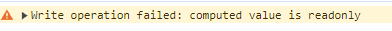

# Vue3学习笔记

> 此笔记使用Vite搭建Vue3、结合TS使用

## 1、使用Vite创建Vue3工程

对node的版本有要求，好像是node>18

```shell
npm create vite@latest
```

后面的选项就看个人需求了


这样vite就给你创建了一个<mark>默认的Vue3模版</mark>

## 2、默认Vue3模版介绍


- .vscode 文件夹：表示为vscode默认安装两个插件
- public 文件夹：项目的静态文件夹目录
- src 文件夹：就是我们写源代码的地方
- .gitignore：git的忽略文件
- env.d.ts：为ts声明不认识的文件，比如jpg，css等后缀名文件
- index.html：程序的入口文件
- tsconfig开头文件：所有关于ts的配置
- vite.config.ts：vite的配置，也是整个项目的配置

## 3、setup语法

首先要清晰的明白<mark>setup是一个函数</mark>，与<mark>Vue2中的data、methods、watch是同级的</mark>

1、setup里面可以写的内容跟js一样，<mark>直接声明变量和方法</mark>

```vue
<template>
    <div>{{name}}</div>
</template>
<script lang="ts">
    export default {
        name:'Person',
        setup(){
            let name = 'zhangsan'
            return {name}
        }
    }
</script>
```

2、这里setup<mark>返回了一个对象</mark>，<mark>其实也可以返回一个函数</mark>，我们称这个函数为<mark>渲染函数</mark>，因为返回的函数内容会直接呈现在页面上，这个时候你写的template和script里面的数据都没有用了。

```vue
<template>
    <div>{{ name }}</div>
</template>
<script lang="ts">
    export default {
        name:'Person',
        setup(){
            let name = 'zhangsan'
            return function(){
                return "hh"
            }
        }
    }
</script>
```

3、setup生命周期甚至在beforeCreate之前

```vue
<template>
    <div>{{ name }}</div>
</template>
<script lang="ts">
    export default {
        name:'Person',
        beforeCreate() {
            console.log('beforeCreate')
        },
        setup(){
            console.log('setup')
            let name = 'zhangsan'
            return {name}
        }
    }
</script>
// 控制台打印
// setup
// beforeCreate
```

总结：

- **setup是一个函数，与vue2中的data、methods同级**
- **setup可以返回一个对象（对象可以在模版中使用），也可以返回函数（渲染函数）**
- **setup中没有this指向**
- **setup生命周期甚至在beforeCreated之前，所以当setup与data同时存在时，data能读取到setup的数据，但是setup不能读取data里面的数据**

## 4、setup语法糖

原来的setup中，我们必须写在export default中，还必须写return 返回值，那有没有简便的写法呢，有了，就是setup的语法糖

```vue
<template>
    <div>{{ name }}</div>
</template>
<script lang="ts">
    export default {
        name:'Person',
    }
</script>
<script lang="ts" setup>
    let name = "zhangsan"
</script>
```

<mark>在script标签内直接写上setup</mark>，就相当于原来setup函数中写的内容，他会自动给你return返回值。

但是这样有个缺点，就是组件的名字name，还必须另外写一个script标签，当然这里有一些解决办法

1. **就是像上方代码一样，写两个script标签**
2. **也可以直接不写组件的name，那么默认组件的文件名就是它的name**
3. **利用vite-plugin-vue-setup-extend插件实现**

下面讲解第三种方式如何实现：

1、首先安装依赖：

```shell
npm i vite-plugin-vue-setup-extend -D
```

2、配置vite文件，引入这个插件，并调用

```shell
import { fileURLToPath, URL } from 'node:url'

import { defineConfig } from 'vite'
import vue from '@vitejs/plugin-vue'
import vueSetupExtend from 'vite-plugin-vue-setup-extend'

// https://vitejs.dev/config/
export default defineConfig({
  plugins: [
    vue(),
    vueSetupExtend()
  ],
  resolve: {
    alias: {
      '@': fileURLToPath(new URL('./src', import.meta.url))
    }
  }
})
```

3、如何使用，直接在script标签上写name

```vue
<template>
    <div>{{ name }}</div>
</template>
<script lang="ts" setup name="Person1234">
    let name = "zhangsan"
</script>
```

## 5、ref函数

在原来的数据中，直接在setup中return对象的数据是<mark>不具备响应式的</mark>

那如何实现呢？看下方代码

```vue
<template>
  <div id="app">
    <div id="textContainer">
      {{ message }}
    </div>
    <button @click="changeText">修改文本</button>
  </div>
</template>

<script setup>
import { ref } from 'vue';

// 使用 ref 创建一个响应式数据
const message = ref('hello, world!');

// 定义方法
const changeText = () => {
  message.value = '你好，中国！';
};
</script>

<style scoped>
#textContainer {
  font-weight: bold;
}
</style>
```

我们行行来解读

```js
import { ref } from 'vue';

// 使用 ref 创建一个响应式数据
const message = ref('hello, world!');
```

这里引入了ref响应函数，并用ref声明一个初始值为”**hello, world!**“的变量，这样，当页面启动的时候，{{}}双大括号会读取里面变量对应的初始值，这里读取的变量为message，它对应的初始值就是”**hello, world!**“。

```js
// 定义方法
const changeText = () => {
  message.value = '你好，中国！';
};
```

这里声明了一个方法，通过点击按钮触发方法，会改变message得值为**你好，中国！**，然后{{}}会显示message变量最新的值，然后显示为**你好，中国！。**

这里就是我们vue响应式的好处，我们一旦声明了一个ref响应式变量，只要这个变量的值一遍，对应页面的值就自动变更了，不用再调用document等js原生方法，是不是超级简洁和方便！

> 总结一下：
>
> - 使用ref函数将你的变量包装起来，就能做到响应式
> - 使用ref包装的变量如果想在setup中使用，必须通过变量.value才能获取到值
> - 在template模版中，不用.value，因为vue会自动给你加上.value

## 6、reactive函数

### 语法

```js
// 引入reactive
import { reactive } from 'vue';
// 声明响应式对象reactive
const reactiveObject = reactive({ /* 对象属性 */ });
```

### 示例

```vue
<template>
  <div>
    <p>Count is: {{ myObject.count }}</p>
    <button @click="increment">增加</button>
  </div>
</template>

<script setup>
import { reactive } from 'vue';

// 使用 reactive 创建一个包含响应式数据的对象
const myObject = reactive({
  count: 0
});

// 定义方法
const increment = () => {
  myObject.count++;
};
</script>
```

## 7、ref函数与reactice函数的区别

> 1. ref 可以定义基本数据类型、也可以定义对象数据类型
> 2. reactive 只能定义对象数据类型

区别：

> 1. ref 定义的变量必须.value才能访问（你可以使用volar插件在vscode中设置里勾选do not value，这样vscode会自动给你加上.value）
>
> 2. reactive 使用时会有局限性，当你重新替换给变量赋值时，变量的响应式会丢失
>     举个例子：
>
>   ```js
>   let state = reactive({ count: 0 })
>   
>   // 上面的 ({ count: 0 }) 引用将不再被追踪
>   // (响应性连接已丢失！)
>   state = reactive({ count: 1 })
>   ```
>
>   同样的，解构操作也会丢失响应式
>
>   ```js
>   const state = reactive({ count: 0 })
>   
>   // 当解构时，count 已经与 state.count 断开连接
>   let { count } = state
>   // 不会影响原始的 state
>   count++
>   ```
>


## 8、toRefs和toRef

使用reactive出来的响应式对象，在解构之后是不具备响应式的。

<mark>toRefs和toRef都是用于解构响应式对象后，让解构出来的变量仍然具有响应式</mark>

### toRef

```vue
<script setup>
  import { reactive, toRef } from 'vue';

  let info = reactive({
    name: 'Echo',
    age: 26,
  })

  let age = toRef(info, 'age');

  const updateInfoObjAge = () => {
    info.age++;
  }
  const updateAge = () => {
    age.value++;
  }
</script>

<template>
  <div id="app">
    <p>info对象中的age：{{ info.age }}</p>
    <button @click="updateInfoObjAge">更新info对象中的 age</button>

    <br />
    <p>使用toRef函数转换后的age：{{ age }}</p>
    <button @click="updateAge">更新 age</button>
  </div>
</template>
```

我们使用 reactive 创建了一个名为 info 的响应式对象，包含 name 和 age 属性。

然后使用 toRef 函数将 info 对象的 age 属性转换为一个独立的 ref 对象。

接着定义了两个方法 updateInfoObjAge 和 updateAge，分别用于更新 info 对象的 age 属性和 age 引用的值

从上面的代码中，我们可以看到，age 属性是使用 toRef 函数转换的具有响应式的 ref 属性，当我们更新时，使用 reactive 定义的响应式对象 info 中的 age 也会随着更新

### toRefs

```vue
<script setup>
  import { reactive, toRefs } from 'vue';

  let info = reactive({
    name: 'Echo',
    age: 26,
    gender: 'Male',
  })

  let { name, age, gender } = toRefs(info);

  const update = () => {
    name.value = 'Julie';
    age.value = 33;
    gender.value = 'Female';
  }
</script>

<template>
  <div id="app">
    <p>info对象中的name：{{ info.name }}</p>
    <p>info对象中的age：{{ info.age }}</p>
    <p>info对象中的gender：{{ info.gender }}</p>

    <br />
    <p>解构出来的name：{{ name }}</p>
    <p>解构出来的age：{{ age }}</p>
    <p>解构出来的gender：{{ gender }}</p>
    <button @click="update">更新数据</button>
  </div>
</template>
```

首先，使用 reactive 函数创建了一个响应式对象 info，包含了 name、age 和 gender 三个属性，同时设置了初始值。

接着，使用 toRefs 函数将 info 对象转换为多个独立的响应式引用对象。然后通过解构赋值，把 name、age 和 gender 三个响应式引用对象分别赋给了相应的变量。

最后，添加了一个按钮，点击按钮会触发 update 函数，在 update 函数中，通过修改响应式引用对象的 value 属性来更新数据的值。

我们可以看到，解构出来的每个属性，都是独立的具有 ref 响应式的属性，因此，我们需要使用 .value 才能访问和修改其值。

## 9、computed计算属性

 computed计算属性是指可以依赖别的值，自动追踪依赖式响应。

computed是一个方法，<mark>返回一个ref属性</mark>，你可以在script中通过.value获取访问值，在模版中也会自动解包。

下面是一个例子：

```vue
<template>
    姓：<input type="text" v-model="firstName">
    名：<input type="text" v-model="lastName">
    全名：<span>{{ fullName }}</span>
</template>
<script setup>
import { ref,computed } from "vue";
let firstName = ref("")
let lastName = ref("")

let fullName = computed(()=> {
    return firstName.value.slice(0,1).toUpperCase() + firstName.value.slice(1) + '--' + lastName.value
})
</script>
```

但是上面的计算属性是只读的，当你尝试直接修改计算属性，他会报以下错误



有没有方法可以直接修改computed计算属性呢，当然可以！

```vue
<template>
    姓：<input type="text" v-model="firstName">
    名：<input type="text" v-model="lastName">
    全名：<span>{{ fullName }}</span>
    <button @click="changeFullName">直接修改fullName</button>
</template>
<script setup>
import { ref,computed } from "vue";
let firstName = ref("")
let lastName = ref("")

let fullName = computed({
    get(){
        return firstName.value.slice(0,1).toUpperCase() + firstName.value.slice(1) + '--' + lastName.value
    },
    set(newVal){
        firstName.value = newVal.split('-')[0]
        lastName.value = newVal.split('-')[1]
    }
})

let changeFullName = ()=>{
    fullName.value = "li-si"
}
</script>
```

## 10、watch监听属性

watch是一个函数，函数有三个参数：第一个参数是被监听的变量，第二个参数是回调函数（就是当监听的变量发生变化时所执行的函数），【回调函数有两个参数，第一个是newVal，第二个是oldVal】，第三个参数是一个配置对象，比如深度监听deep，立即监听immediate。

### 情况一：**监听ref定义的基本类型的数据**

**监听ref定义的基本类型的数据**

```vue
<template>
    <span>sum: {{ sum }}</span>
    <button @click="addSum">+1</button>
</template>
<script setup>
import { ref,watch } from "vue";
let sum = ref(0)

let addSum = () => {
    sum.value += 1
}

const stopWath = watch(sum,(newVal,oldVal) => {
    console.log("sum改变了",newVal,oldVal);
    if(newVal > 10){
        stopWath()
    }
})


</script>
```

> 注意点
>
> 1、监听ref定义的基本类型，watch函数的第一个参数直接写变量就可以 ，<mark>不用.value</mark>

### 情况二：**监听ref定义的对象类型的数据**

**监听ref定义的对象类型的数据**

```vue
<template>
    姓名：<p>{{ person.name }}</p>
    年龄：<p>{{ person.age }}</p>
    <button @click="changeName">修改姓名</button>
    <button @click="changeAge">修改年龄</button>
    <button @click="changePerson">修改全部</button>
</template>
<script setup>
import { ref,watch } from "vue";
let person = ref({
    name: 'zhangsan',
    age: 18
})

let changeName = () => {
    person.value.name += '~'
}

let changeAge = () => {
    person.value.age += 1
}

let changePerson = () => {
    person.value = { name:'lisi', age:20}
}

watch(person,(nv,ov) => {
    console.log("person改变了",nv,ov);
},{deep:true})


</script>
```

> 注意点：
>
> 1、监听ref定义的对象类型时，如果没有深度监听属性，那么修改对象中的某一个属性是不会被监听到改变
>
> 2、监听ref定义的对象类型时，如果加上了深度监听属性，<mark>无论是修改对象中的某一个属性还是修改整个对象都会被监听到</mark>，但是如果只是修改对象中的某一个属性，所监听到的属性的新值和旧值都是一样的

### 情况三：监听reactive定义的对象类型的数据

```vue
<template>
    姓名：<p>{{ person.name }}</p>
    年龄：<p>{{ person.age }}</p>
    <button @click="changeName">修改姓名</button>
    <button @click="changeAge">修改年龄</button>
    <button @click="changePerson">修改全部</button>
    <hr>
    c的值:<p> {{ a.b.c }}</p>
    <button @click="changeC">修改c的值</button>
</template>
<script setup>
import { reactive,watch } from "vue";
let person = reactive({
    name: 'zhangsan',
    age: 18
})


let changeName = () => {
    person.name += '~'
}

let changeAge = () => {
    person.age += 1
}

let changePerson = () => {
    Object.assign(person,{name:'lisi',age:20})
}

watch(person,(nv,ov) => {
    console.log("person改变了",nv,ov);
})

let a = reactive({
    b: {
        c: 10
    }
})

let changeC = () => {
    a.b.c += 1
}

watch(a,(nv,ov) => {
    console.log("a值被改变了",nv,ov)
})


</script>
```

> 注意点：
>
> 1、监听reactive定义的对象数据与监听ref定义的对象数据一样，修改内部数据 新值与旧值相同，修改整个数据，新值与旧值也相同 
>
> 但有所不同的是，reactive的对象数据类型<mark>默认深度监听，且不可修改</mark>

### 情况四：监听对象数据类型中的某一个属性

```vue
<template>
    姓名：<p>{{ person.name }}</p>
    年龄：<p>{{ person.age }}</p>
    <button @click="changeName">修改姓名</button>
    <button @click="changeAge">修改年龄</button>
    <button @click="changePerson">修改全部</button>
    
</template>
<script setup>
import { ref,reactive,watch } from "vue";
let person = ref({
    name: 'zhangsan',
    age: 18
})


let changeName = () => {
    person.value.name += '~'
}

let changeAge = () => {
    person.value.age += 1
}

let changePerson = () => {
    person.value = {name:'lisi',age:20}
    // Object.assign(person,{name:'lisi',age:20})
}

watch(() => person.value.name,(nv,ov) => {
    console.log("person改变了",nv,ov);
})

</script>
```

> 注意点：
>
> 1、无论是监听ref定义还是reactive定义的对象类型中的某一个属性，都必须写成函数式监听

### 情况五：同时监听多个数据

```vue
<template>
    姓名：<p>{{ person.name }}</p>
    年龄：<p>{{ person.age }}</p>
    车1：<p>{{ person.car.c1 }}</p>
    车2：<p>{{ person.car.c2 }}</p>
    <button @click="changeName">修改姓名</button>
    <button @click="changeAge">修改年龄</button>
    <button @click="changePerson">修改全部</button>
    
</template>
<script setup>
import { ref,reactive,watch } from "vue";
let person = ref({
    name: 'zhangsan',
    age: 18,
    car: {
        c1: '奔驰',
        c2: '宝马'
    }
})


let changeName = () => {
    person.value.name += '~'
}

let changeAge = () => {
    person.value.age += 1
}

let changePerson = () => {
    person.value = {name:'lisi',age:20 ,car:{c1:'雅迪',c2:'艾玛'}}
}

watch([() => person.value.name,() => person.value.car.c1],(nv,ov) => {
    console.log("person改变了",nv,ov);
})

</script>
```

> 注意点
>
> 1、监听多个数据必须以数组形式，然后函数里面的newVal，oldVal也是数组

## 11、watchEffect监听函数

watchEffect函数对比watch函数：

watchEffect函数会立即运行，并且会自动的监听你在函数中使用的值（适合你要监听的数据比较多的时候）

举个例子：

```vue
<template>
    姓名：<p>{{ person.name }}</p>
    年龄：<p>{{ person.age }}</p>
    车1：<p>{{ person.car.c1 }}</p>
    车2：<p>{{ person.car.c2 }}</p>
    <button @click="changeName">修改姓名</button>
    <button @click="changeAge">修改年龄</button>
    <button @click="changePerson">修改全部</button>
    
</template>
<script setup>
import { ref,reactive,watch,watchEffect } from "vue";
let person = ref({
    name: 'zhangsan',
    age: 18,
    car: {
        c1: '奔驰',
        c2: '宝马'
    }
})


let changeName = () => {
    person.value.name += '~'
}

let changeAge = () => {
    person.value.age += 1
}

let changePerson = () => {
    person.value = {name:'lisi',age:20 ,car:{c1:'雅迪',c2:'艾玛'}}
}

watchEffect(() => {
    console.log("person改变了",person.value);
    console.log("person改变了name",person.value.name);
    console.log("person改变了age",person.value.age);
})

</script>
```

## 12、ref标签

先来回顾Vue2中的ref标签，我们通过给元素添加ref='xxx'的属性，然后在代码中通过this.$refs.xxx获取到dom元素

```vue
<template>
  <div id="app">
    <div ref="hello">小猪课堂</div>
  </div>
</template>
<script>
export default {
  mounted() {
    console.log(this.$refs.hello); // <div>小猪课堂</div>
  },
};
</script>
```

在Vue3中获取元素的方式与Vue2不同，在Vue3中我们是没有this对象的，我们需要通过ref引用来获取dom元素

```vue
<template>
    <p ref="hello">你好</p>
    <button @click="getP">点击dom元素</button>
</template>
<script setup>
import { ref } from "vue";

let hello = ref(null)
let getP = () => {
    console.log(hello.value)  // <p>你好</p>
}
</script>
```

当然前面都是默认的html元素，如果是我们**自己定义的组件**呢

子组件：

```vue
<template>
    <p ref="hello">你好</p>
    <button @click="getP">点击dom元素</button>
</template>
<script setup>
import { ref } from "vue";

let hello = ref()
let a = ref(0)
let b = ref(1)
let c = ref(2)
let getP = () => {
    console.log(hello.value)
}
</script>
```

父组件：

```vue
<template>
  <button @click="getSon">获取子元素数据</button>
 <Person ref="p"></Person>
</template>

<script lang="ts" setup>
import Person from './components/Person.vue'
import { ref } from 'vue'

let p = ref(null)

let getSon = () => {
  console.log(p.value)
  console.log(p.value.a)  // undefined
}
</script>
```

默认情况下，父组件不能访问子组件的数据，所以上面是undefined

需要在子组件中使用defineExpose({  a,  b }) 暴露数据，而且不需要引入

```vue
defineExpose({a,b})
```

