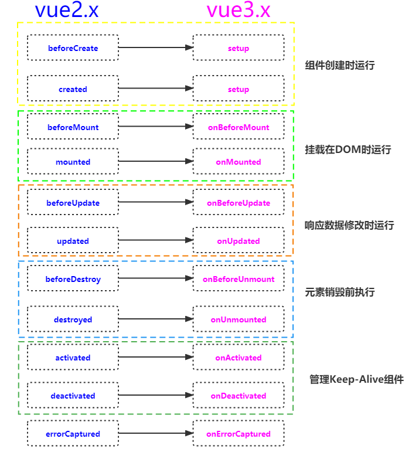
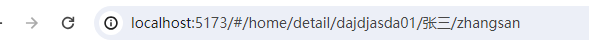
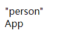
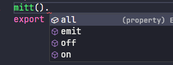

# Vue3学习笔记

> 此笔记使用Vite搭建Vue3、结合TS使用

## 1、使用Vite创建Vue3工程

对node的版本有要求，好像是node>18

```shell
npm create vite@latest
```

后面的选项就看个人需求了


这样vite就给你创建了一个<mark>默认的Vue3模版</mark>

## 2、默认Vue3模版介绍


- .vscode 文件夹：表示为vscode默认安装两个插件
- public 文件夹：项目的静态文件夹目录
- src 文件夹：就是我们写源代码的地方
- .gitignore：git的忽略文件
- env.d.ts：为ts声明不认识的文件，比如jpg，css等后缀名文件
- index.html：程序的入口文件
- tsconfig开头文件：所有关于ts的配置
- vite.config.ts：vite的配置，也是整个项目的配置

## 3、setup语法

首先要清晰的明白<mark>setup是一个函数</mark>，与<mark>Vue2中的data、methods、watch是同级的</mark>

1、setup里面可以写的内容跟js一样，<mark>直接声明变量和方法</mark>

```vue
<template>
    <div>{{name}}</div>
</template>
<script lang="ts">
    export default {
        name:'Person',
        setup(){
            let name = 'zhangsan'
            return {name}
        }
    }
</script>
```

2、这里setup<mark>返回了一个对象</mark>，<mark>其实也可以返回一个函数</mark>，我们称这个函数为<mark>渲染函数</mark>，因为返回的函数内容会直接呈现在页面上，这个时候你写的template和script里面的数据都没有用了。

```vue
<template>
    <div>{{ name }}</div>
</template>
<script lang="ts">
    export default {
        name:'Person',
        setup(){
            let name = 'zhangsan'
            return function(){
                return "hh"
            }
        }
    }
</script>
```

3、setup生命周期甚至在beforeCreate之前

```vue
<template>
    <div>{{ name }}</div>
</template>
<script lang="ts">
    export default {
        name:'Person',
        beforeCreate() {
            console.log('beforeCreate')
        },
        setup(){
            console.log('setup')
            let name = 'zhangsan'
            return {name}
        }
    }
</script>
// 控制台打印
// setup
// beforeCreate
```

总结：

- **setup是一个函数，与vue2中的data、methods同级**
- **setup可以返回一个对象（对象可以在模版中使用），也可以返回函数（渲染函数）**
- **setup中没有this指向**
- **setup生命周期甚至在beforeCreated之前，所以当setup与data同时存在时，data能读取到setup的数据，但是setup不能读取data里面的数据**

## 4、setup语法糖

原来的setup中，我们必须写在export default中，还必须写return 返回值，那有没有简便的写法呢，有了，就是setup的语法糖

```vue
<template>
    <div>{{ name }}</div>
</template>
<script lang="ts">
    export default {
        name:'Person',
    }
</script>
<script lang="ts" setup>
    let name = "zhangsan"
</script>
```

<mark>在script标签内直接写上setup</mark>，就相当于原来setup函数中写的内容，他会自动给你return返回值。

但是这样有个缺点，就是组件的名字name，还必须另外写一个script标签，当然这里有一些解决办法

1. **就是像上方代码一样，写两个script标签**
2. **也可以直接不写组件的name，那么默认组件的文件名就是它的name**
3. **利用vite-plugin-vue-setup-extend插件实现**

下面讲解第三种方式如何实现：

1、首先安装依赖：

```shell
npm i vite-plugin-vue-setup-extend -D
```

2、配置vite文件，引入这个插件，并调用

```shell
import { fileURLToPath, URL } from 'node:url'

import { defineConfig } from 'vite'
import vue from '@vitejs/plugin-vue'
import vueSetupExtend from 'vite-plugin-vue-setup-extend'

// https://vitejs.dev/config/
export default defineConfig({
  plugins: [
    vue(),
    vueSetupExtend()
  ],
  resolve: {
    alias: {
      '@': fileURLToPath(new URL('./src', import.meta.url))
    }
  }
})
```

3、如何使用，直接在script标签上写name

```vue
<template>
    <div>{{ name }}</div>
</template>
<script lang="ts" setup name="Person1234">
    let name = "zhangsan"
</script>
```

## 5、ref函数

在原来的数据中，直接在setup中return对象的数据是<mark>不具备响应式的</mark>

那如何实现呢？看下方代码

```vue
<template>
  <div id="app">
    <div id="textContainer">
      {{ message }}
    </div>
    <button @click="changeText">修改文本</button>
  </div>
</template>

<script setup>
import { ref } from 'vue';

// 使用 ref 创建一个响应式数据
const message = ref('hello, world!');

// 定义方法
const changeText = () => {
  message.value = '你好，中国！';
};
</script>

<style scoped>
#textContainer {
  font-weight: bold;
}
</style>
```

我们行行来解读

```js
import { ref } from 'vue';

// 使用 ref 创建一个响应式数据
const message = ref('hello, world!');
```

这里引入了ref响应函数，并用ref声明一个初始值为”**hello, world!**“的变量，这样，当页面启动的时候，{{}}双大括号会读取里面变量对应的初始值，这里读取的变量为message，它对应的初始值就是”**hello, world!**“。

```js
// 定义方法
const changeText = () => {
  message.value = '你好，中国！';
};
```

这里声明了一个方法，通过点击按钮触发方法，会改变message得值为**你好，中国！**，然后{{}}会显示message变量最新的值，然后显示为**你好，中国！。**

这里就是我们vue响应式的好处，我们一旦声明了一个ref响应式变量，只要这个变量的值一遍，对应页面的值就自动变更了，不用再调用document等js原生方法，是不是超级简洁和方便！

> 总结一下：
>
> - 使用ref函数将你的变量包装起来，就能做到响应式
> - 使用ref包装的变量如果想在setup中使用，必须通过变量.value才能获取到值
> - 在template模版中，不用.value，因为vue会自动给你加上.value

## 6、reactive函数

### 语法

```js
// 引入reactive
import { reactive } from 'vue';
// 声明响应式对象reactive
const reactiveObject = reactive({ /* 对象属性 */ });
```

### 示例

```vue
<template>
  <div>
    <p>Count is: {{ myObject.count }}</p>
    <button @click="increment">增加</button>
  </div>
</template>

<script setup>
import { reactive } from 'vue';

// 使用 reactive 创建一个包含响应式数据的对象
const myObject = reactive({
  count: 0
});

// 定义方法
const increment = () => {
  myObject.count++;
};
</script>
```

## 7、ref函数与reactice函数的区别

> 1. ref 可以定义基本数据类型、也可以定义对象数据类型
> 2. reactive 只能定义对象数据类型

区别：

> 1. ref 定义的变量必须.value才能访问（你可以使用volar插件在vscode中设置里勾选do not value，这样vscode会自动给你加上.value）
>
> 2. reactive 使用时会有局限性，当你重新替换给变量赋值时，变量的响应式会丢失
>     举个例子：
>
>   ```js
>   let state = reactive({ count: 0 })
>   
>   // 上面的 ({ count: 0 }) 引用将不再被追踪
>   // (响应性连接已丢失！)
>   state = reactive({ count: 1 })
>   ```
>
>   同样的，解构操作也会丢失响应式
>
>   ```js
>   const state = reactive({ count: 0 })
>   
>   // 当解构时，count 已经与 state.count 断开连接
>   let { count } = state
>   // 不会影响原始的 state
>   count++
>   ```
>


## 8、toRefs和toRef

使用reactive出来的响应式对象，在解构之后是不具备响应式的。

<mark>toRefs和toRef都是用于解构响应式对象后，让解构出来的变量仍然具有响应式</mark>

### toRef

```vue
<script setup>
  import { reactive, toRef } from 'vue';

  let info = reactive({
    name: 'Echo',
    age: 26,
  })

  let age = toRef(info, 'age');

  const updateInfoObjAge = () => {
    info.age++;
  }
  const updateAge = () => {
    age.value++;
  }
</script>

<template>
  <div id="app">
    <p>info对象中的age：{{ info.age }}</p>
    <button @click="updateInfoObjAge">更新info对象中的 age</button>

    <br />
    <p>使用toRef函数转换后的age：{{ age }}</p>
    <button @click="updateAge">更新 age</button>
  </div>
</template>
```

我们使用 reactive 创建了一个名为 info 的响应式对象，包含 name 和 age 属性。

然后使用 toRef 函数将 info 对象的 age 属性转换为一个独立的 ref 对象。

接着定义了两个方法 updateInfoObjAge 和 updateAge，分别用于更新 info 对象的 age 属性和 age 引用的值

从上面的代码中，我们可以看到，age 属性是使用 toRef 函数转换的具有响应式的 ref 属性，当我们更新时，使用 reactive 定义的响应式对象 info 中的 age 也会随着更新

### toRefs

```vue
<script setup>
  import { reactive, toRefs } from 'vue';

  let info = reactive({
    name: 'Echo',
    age: 26,
    gender: 'Male',
  })

  let { name, age, gender } = toRefs(info);

  const update = () => {
    name.value = 'Julie';
    age.value = 33;
    gender.value = 'Female';
  }
</script>

<template>
  <div id="app">
    <p>info对象中的name：{{ info.name }}</p>
    <p>info对象中的age：{{ info.age }}</p>
    <p>info对象中的gender：{{ info.gender }}</p>

    <br />
    <p>解构出来的name：{{ name }}</p>
    <p>解构出来的age：{{ age }}</p>
    <p>解构出来的gender：{{ gender }}</p>
    <button @click="update">更新数据</button>
  </div>
</template>
```

首先，使用 reactive 函数创建了一个响应式对象 info，包含了 name、age 和 gender 三个属性，同时设置了初始值。

接着，使用 toRefs 函数将 info 对象转换为多个独立的响应式引用对象。然后通过解构赋值，把 name、age 和 gender 三个响应式引用对象分别赋给了相应的变量。

最后，添加了一个按钮，点击按钮会触发 update 函数，在 update 函数中，通过修改响应式引用对象的 value 属性来更新数据的值。

我们可以看到，解构出来的每个属性，都是独立的具有 ref 响应式的属性，因此，我们需要使用 .value 才能访问和修改其值。

## 9、computed计算属性

 computed计算属性是指可以依赖别的值，自动追踪依赖式响应。

computed是一个方法，<mark>返回一个ref属性</mark>，你可以在script中通过.value获取访问值，在模版中也会自动解包。

下面是一个例子：

```vue
<template>
    姓：<input type="text" v-model="firstName">
    名：<input type="text" v-model="lastName">
    全名：<span>{{ fullName }}</span>
</template>
<script setup>
import { ref,computed } from "vue";
let firstName = ref("")
let lastName = ref("")

let fullName = computed(()=> {
    return firstName.value.slice(0,1).toUpperCase() + firstName.value.slice(1) + '--' + lastName.value
})
</script>
```

但是上面的计算属性是只读的，当你尝试直接修改计算属性，他会报以下错误


有没有方法可以直接修改computed计算属性呢，当然可以！

```vue
<template>
    姓：<input type="text" v-model="firstName">
    名：<input type="text" v-model="lastName">
    全名：<span>{{ fullName }}</span>
    <button @click="changeFullName">直接修改fullName</button>
</template>
<script setup>
import { ref,computed } from "vue";
let firstName = ref("")
let lastName = ref("")

let fullName = computed({
    get(){
        return firstName.value.slice(0,1).toUpperCase() + firstName.value.slice(1) + '--' + lastName.value
    },
    set(newVal){
        firstName.value = newVal.split('-')[0]
        lastName.value = newVal.split('-')[1]
    }
})

let changeFullName = ()=>{
    fullName.value = "li-si"
}
</script>
```

## 10、watch监听属性

watch是一个函数，函数有三个参数：第一个参数是被监听的变量，第二个参数是回调函数（就是当监听的变量发生变化时所执行的函数），【回调函数有两个参数，第一个是newVal，第二个是oldVal】，第三个参数是一个配置对象，比如深度监听deep，立即监听immediate。

### 情况一：**监听ref定义的基本类型的数据**

**监听ref定义的基本类型的数据**

```vue
<template>
    <span>sum: {{ sum }}</span>
    <button @click="addSum">+1</button>
</template>
<script setup>
import { ref,watch } from "vue";
let sum = ref(0)

let addSum = () => {
    sum.value += 1
}

const stopWath = watch(sum,(newVal,oldVal) => {
    console.log("sum改变了",newVal,oldVal);
    if(newVal > 10){
        stopWath()
    }
})


</script>
```

> 注意点
>
> 1、监听ref定义的基本类型，watch函数的第一个参数直接写变量就可以 ，<mark>不用.value</mark>

### 情况二：**监听ref定义的对象类型的数据**

**监听ref定义的对象类型的数据**

```vue
<template>
    姓名：<p>{{ person.name }}</p>
    年龄：<p>{{ person.age }}</p>
    <button @click="changeName">修改姓名</button>
    <button @click="changeAge">修改年龄</button>
    <button @click="changePerson">修改全部</button>
</template>
<script setup>
import { ref,watch } from "vue";
let person = ref({
    name: 'zhangsan',
    age: 18
})

let changeName = () => {
    person.value.name += '~'
}

let changeAge = () => {
    person.value.age += 1
}

let changePerson = () => {
    person.value = { name:'lisi', age:20}
}

watch(person,(nv,ov) => {
    console.log("person改变了",nv,ov);
},{deep:true})


</script>
```

> 注意点：
>
> 1、监听ref定义的对象类型时，如果没有深度监听属性，那么修改对象中的某一个属性是不会被监听到改变
>
> 2、监听ref定义的对象类型时，如果加上了深度监听属性，<mark>无论是修改对象中的某一个属性还是修改整个对象都会被监听到</mark>，但是如果只是修改对象中的某一个属性，所监听到的属性的新值和旧值都是一样的

### 情况三：监听reactive定义的对象类型的数据

```vue
<template>
    姓名：<p>{{ person.name }}</p>
    年龄：<p>{{ person.age }}</p>
    <button @click="changeName">修改姓名</button>
    <button @click="changeAge">修改年龄</button>
    <button @click="changePerson">修改全部</button>
    <hr>
    c的值:<p> {{ a.b.c }}</p>
    <button @click="changeC">修改c的值</button>
</template>
<script setup>
import { reactive,watch } from "vue";
let person = reactive({
    name: 'zhangsan',
    age: 18
})


let changeName = () => {
    person.name += '~'
}

let changeAge = () => {
    person.age += 1
}

let changePerson = () => {
    Object.assign(person,{name:'lisi',age:20})
}

watch(person,(nv,ov) => {
    console.log("person改变了",nv,ov);
})

let a = reactive({
    b: {
        c: 10
    }
})

let changeC = () => {
    a.b.c += 1
}

watch(a,(nv,ov) => {
    console.log("a值被改变了",nv,ov)
})


</script>
```

> 注意点：
>
> 1、监听reactive定义的对象数据与监听ref定义的对象数据一样，修改内部数据 新值与旧值相同，修改整个数据，新值与旧值也相同 
>
> 但有所不同的是，reactive的对象数据类型<mark>默认深度监听，且不可修改</mark>

### 情况四：监听对象数据类型中的某一个属性

```vue
<template>
    姓名：<p>{{ person.name }}</p>
    年龄：<p>{{ person.age }}</p>
    <button @click="changeName">修改姓名</button>
    <button @click="changeAge">修改年龄</button>
    <button @click="changePerson">修改全部</button>
    
</template>
<script setup>
import { ref,reactive,watch } from "vue";
let person = ref({
    name: 'zhangsan',
    age: 18
})


let changeName = () => {
    person.value.name += '~'
}

let changeAge = () => {
    person.value.age += 1
}

let changePerson = () => {
    person.value = {name:'lisi',age:20}
    // Object.assign(person,{name:'lisi',age:20})
}

watch(() => person.value.name,(nv,ov) => {
    console.log("person改变了",nv,ov);
})

</script>
```

> 注意点：
>
> 1、无论是监听ref定义还是reactive定义的对象类型中的某一个属性，都必须写成函数式监听

### 情况五：同时监听多个数据

```vue
<template>
    姓名：<p>{{ person.name }}</p>
    年龄：<p>{{ person.age }}</p>
    车1：<p>{{ person.car.c1 }}</p>
    车2：<p>{{ person.car.c2 }}</p>
    <button @click="changeName">修改姓名</button>
    <button @click="changeAge">修改年龄</button>
    <button @click="changePerson">修改全部</button>
    
</template>
<script setup>
import { ref,reactive,watch } from "vue";
let person = ref({
    name: 'zhangsan',
    age: 18,
    car: {
        c1: '奔驰',
        c2: '宝马'
    }
})


let changeName = () => {
    person.value.name += '~'
}

let changeAge = () => {
    person.value.age += 1
}

let changePerson = () => {
    person.value = {name:'lisi',age:20 ,car:{c1:'雅迪',c2:'艾玛'}}
}

watch([() => person.value.name,() => person.value.car.c1],(nv,ov) => {
    console.log("person改变了",nv,ov);
})

</script>
```

> 注意点
>
> 1、监听多个数据必须以数组形式，然后函数里面的newVal，oldVal也是数组

## 11、watchEffect监听函数

watchEffect函数对比watch函数：

watchEffect函数会立即运行，并且会自动的监听你在函数中使用的值（适合你要监听的数据比较多的时候）

举个例子：

```vue
<template>
    姓名：<p>{{ person.name }}</p>
    年龄：<p>{{ person.age }}</p>
    车1：<p>{{ person.car.c1 }}</p>
    车2：<p>{{ person.car.c2 }}</p>
    <button @click="changeName">修改姓名</button>
    <button @click="changeAge">修改年龄</button>
    <button @click="changePerson">修改全部</button>
    
</template>
<script setup>
import { ref,reactive,watch,watchEffect } from "vue";
let person = ref({
    name: 'zhangsan',
    age: 18,
    car: {
        c1: '奔驰',
        c2: '宝马'
    }
})


let changeName = () => {
    person.value.name += '~'
}

let changeAge = () => {
    person.value.age += 1
}

let changePerson = () => {
    person.value = {name:'lisi',age:20 ,car:{c1:'雅迪',c2:'艾玛'}}
}

watchEffect(() => {
    console.log("person改变了",person.value);
    console.log("person改变了name",person.value.name);
    console.log("person改变了age",person.value.age);
})

</script>
```

## 12、ref标签

先来回顾Vue2中的ref标签，我们通过给元素添加ref='xxx'的属性，然后在代码中通过this.$refs.xxx获取到dom元素

```vue
<template>
  <div id="app">
    <div ref="hello">小猪课堂</div>
  </div>
</template>
<script>
export default {
  mounted() {
    console.log(this.$refs.hello); // <div>小猪课堂</div>
  },
};
</script>
```

在Vue3中获取元素的方式与Vue2不同，在Vue3中我们是没有this对象的，我们需要通过ref引用来获取dom元素

```vue
<template>
    <p ref="hello">你好</p>
    <button @click="getP">点击dom元素</button>
</template>
<script setup>
import { ref } from "vue";

let hello = ref(null)
let getP = () => {
    console.log(hello.value)  // <p>你好</p>
}
</script>
```

当然前面都是默认的html元素，如果是我们**自己定义的组件**呢

子组件：

```vue
<template>
    <p ref="hello">你好</p>
    <button @click="getP">点击dom元素</button>
</template>
<script setup>
import { ref } from "vue";

let hello = ref()
let a = ref(0)
let b = ref(1)
let c = ref(2)
let getP = () => {
    console.log(hello.value)
}
</script>
```

父组件：

```vue
<template>
  <button @click="getSon">获取子元素数据</button>
 <Person ref="p"></Person>
</template>

<script lang="ts" setup>
import Person from './components/Person.vue'
import { ref } from 'vue'

let p = ref(null)

let getSon = () => {
  console.log(p.value)
  console.log(p.value.a)  // undefined
}
</script>
```

默认情况下，父组件不能访问子组件的数据，所以上面是undefined

需要在子组件中使用defineExpose({  a,  b }) 暴露数据，而且不需要引入

```vue
defineExpose({a,b})
```

## 13、props传参

### 1.1普通传参

props可用于父组件向子组件传递参数。下面一个最简单的栗子：

```vue
// 父组件
<template>
    <Person a="123"></Person>
</template>
<script lang="ts" setup>
import Person from './components/Person.vue'
</script>
```

```vue
// Person子组件
<template>
    <div>{{ a }}</div>
</template>
<script lang="ts" setup>
    import {defineProps} from 'vue'
    defineProps(['a'])
</script>
```

当然defineProps的值是可以接受的，接受的是一个对象，因为父组件可能会传递多个值

```vue
// Person子组件
<template>
    <div>{{ a.a }}</div>
</template>
<script lang="ts" setup>
    import {defineProps} from 'vue'
    let a = defineProps(['a'])
</script>
```

### 1.2 传递多个参数

```vue
// 父组件
<template>
    <Person a="123" :list="p"></Person>
</template>
<script lang="ts" setup>
import {reactive} from 'vue'
import {type PersonList} from '@/types'
import Person from './components/Person.vue'

let p = reactive<PersonList>([
    {id:'1221131313',name:'张三',age:18},
    {id:'1221131312',name:'李四',age:20}
])

</script>
```

```vue
// 子组件
<template>
    <div>{{ a }}</div>
    <ul>
        <li v-for="p in list" :key="p.id">
            {{ p.name }} == {{ p.age }}
        </li>
    </ul>
</template>
<script lang="ts" setup>
    import {defineProps} from 'vue'
    defineProps(['a','list'])
</script>
```

### 1.3 传递参数且限制传递的类型

defineProps可以用于泛型约束要传递的参数的类型

```vue
// 父组件
<template>
    <Person a="123" :list="p"></Person>
</template>
<script lang="ts" setup>
import {reactive} from 'vue'
import {type PersonList} from '@/types'
import Person from './components/Person.vue'

let p = reactive<PersonList>([
    {id:'1221131313',name:'张三',age:18},
    {id:'1221131312',name:'李四',age:20}
])

</script>
```

```vue
// 子组件
<template>
    <div>{{ a }}</div>
    <ul>
        <li v-for="p in list" :key="p.id">
            {{ p.name }} == {{ p.age }}
        </li>
    </ul>
</template>
<script lang="ts" setup>
import {type PersonList} from '@/types'
import {defineProps} from 'vue'
defineProps<{list:PersonList,a:string}>()
</script>
```

### 1.4 传递参数的可行性

就是可以穿参数，也可以不穿参数

```vue
defineProps<{list?:PersonList,a:string}>()
```

### 1.5 传递默认值

传递默认值需要用到withDefault函数，有两个参数，第一个就是defineProps，第二个就是默认值，是一个对象

```vue
// 子组件
<template>
    <div>{{ a }}</div>
    <ul>
        <li v-for="p in list" :key="p.id">
            {{ p.name }} == {{ p.age }}
        </li>
    </ul>
</template>
<script lang="ts" setup>
import {type PersonList} from '@/types'
import {defineProps,withDefaults} from 'vue'
withDefaults(defineProps<{list?:PersonList,a:string}>(),{
    list: () => [{id:'dadsda',name:'王五',age:22}]
})
</script>
```

**最后，defineProps可以不用引入，在vue中，由define开头的函数都可以不用引入，因为他们都是宏函数。**

## 14、生命周期



## 15、hooks

其实hooks就是把每个vue中的script可以抽离出来分成模块，其实跟Vue2中的mixin有点类似。

先看下面这个代码：

```vue
<template>
    <div>sum的值:{{ sum }}</div>
    <button @click="addSum">点击sum+1</button>
    <p>页面宽度: {{screen.width}}</p>
    <p>页面高度: {{screen.height}}</p>
    <button @click="getWH">获取页面数据</button>
</template>
<script lang="ts" setup>
import {ref,reactive} from 'vue'
let sum = ref(0)
let addSum = () => {
    sum.value += 1
}

let screen = reactive({
    width: 0,
    height: 0
})
let getWH = () => {
    screen.width = document.documentElement.clientWidth
    screen.height = document.documentElement.clientHeight
}

</script>
```

页面中存在两段逻辑，用于处理不同的数据，当然这只是举个简单的栗子，在真实项目中，代码比这远远复杂的多，所以当代码开始冗余之后，逻辑越来越复杂，

hooks就是解决这一问题的，他可以把单独处理一个数据的逻辑封装起来，最后在vue文件中引入。

看看如何使用：

```vue
<template>
    <div>sum的值:{{ sum }}</div>
    <button @click="addSum">点击sum+1</button>
    <p>页面宽度: {{screen.width}}</p>
    <p>页面高度: {{screen.height}}</p>
    <button @click="getWH">获取页面数据</button>
</template>
<script lang="ts" setup>
import useSum from '@/hooks/useSum'
const {sum,addSum} = useSum()

import useSceen from '@/hooks/useSceen'
const {screen,getWH} = useSceen()

</script>
```

```tsx
// useSum.ts
import {ref} from 'vue'
let sum = ref(0)
let addSum = () => {
    sum.value += 1
}

export default function(){
    return {
        sum,addSum
    }
}
```

```tsx
// useSceen.ts
import {reactive} from 'vue'
let screen = reactive({
    width: 0,
    height: 0
})
let getWH = () => {
    screen.width = document.documentElement.clientWidth
    screen.height = document.documentElement.clientHeight
}

export default function() {
    return {
        screen,getWH
    }
}
```

​	使用Hooks的一些规范：

1. **具备可复用功能，才需要抽离为 hooks 独立文件**
2. **函数名/文件名以 use 开头，形如: useXX**
3. **引用时将响应式变量或者方法显式解构暴露出来；**

在使用hooks尽量导出一个默认函数，而不是直接导出变量和方法，因为函数可以传递参数，直接导出变量和方法不能传递参数

## 16、路由

### 4、1 使用

#### 1、安装Vue Router：

`npm install vue-router@4`

路由的使用步骤：

> 1、创建路由组件
>
> 2、配置路由配置，路由匹配规则
>
> 3、通过createRouter创建路由器，传入routes和history模式
>
> 4、在vue中引入路由并使用
>
> 5、通过`<router-link>`和`<router-view>`

#### 2、在src目录下创建router文件夹再创建index.ts

```typescript
import {createRouter,createWebHashHistory} from 'vue-router'

import Person from '@/components/Person.vue'
import Home from '@/components/Home.vue'
import About from '@/components/About.vue'

const routes = [
    {
        path:'/person',
        component: Person 
    },
    {
        path:'/home',
        component: Home
    },
    {
        path:'/about',
        component: About
    }
]
// 创建路由对象
const router = createRouter({
    routes,
    history: createWebHashHistory()
})

export default router
```

#### 3、在main.ts中引入

```typescript
import '@/css/text.css';
import { createApp } from 'vue'
import App from './App.vue'

import router from '@/router'

// 使用路由
createApp(App).use(router).mount('#app')
```

#### 4、使用路由

```vue
<template>
    <div>
        <router-link to="/home" active-class="is-active">home</router-link>
        <router-link to="/about" active-class="is-active">about</router-link>
        <router-view></router-view>
    </div>
    
</template>
```

### 4、2  to的另一种写法

```vue
<template>
    <div>
        <router-link to="/home" active-class="is-active">home</router-link>
        <router-link :to="{path:'/about'}" active-class="is-active">about</router-link>
        <router-view></router-view>
    </div>
    
</template>
```

### 4、3 嵌套路由

路由规则children

```json
	{
        path:'/home',
        component: Home,
        children:[
            {
                path:'detail',
                component: Detail
            }
        ]
    },
```

匹配：

```vue
<template>
   <h1>Home组件</h1> 
   <router-link :to="{path:'/home/detail'}">detail</router-link>
   <router-view></router-view>
</template>
```

### 4、4 路由传参

路由传参有好几种方式，query、params传参

#### 1、query传参

```vue
// 路由传递组件
<template>
   <h1>Home组件</h1> 
   <router-link :to="{
      path:'/home/detail',
      query: list
   }">
      detail
   </router-link>
   <router-view></router-view>
</template>

<script setup>
import {reactive} from 'vue'
let list = reactive(
   {id:'dajdjasda01',title:'张三',content:'zhangsan'}
)
</script>
```

```vue
// 路由接受组件
<template>
    <h1>Detail组件</h1>
    <ul>
        <li>{{ route.query.title }}---{{ route.query.content }}</li>
    </ul>
</template>
<script setup>
import {useRoute} from 'vue-router'
let route = useRoute()
</script>
```

query传参有个特征是在路由上会展示传递的参数


#### 2、params传参

params传参，必须现在路由上接受参数

```typescript
{
        path:'/home',
        component: Home,
        children:[
            {
                name:'detail',
                path:'detail/:id/:title/:content',
                component: Detail
            }
        ]
}
```

```vue
// 路由传递参数
<template>
   <h1>Home组件</h1> 
   <router-link :to="{
      name:'detail',
      params: list
   }">
      detail
   </router-link>
   <router-view></router-view>
</template>

<script setup>
import {reactive} from 'vue'
let list = reactive(
   {id:'dajdjasda01',title:'张三',content:'zhangsan'}
)
</script>
```

```vue
// 路由接受组件
<template>
    <h1>Detail组件</h1>
    <ul>
        <li>{{ params.title }}---{{ params.content }}</li>
    </ul>
</template>
<script setup>
import {toRefs} from 'vue'
import {useRoute} from 'vue-router'
let route = useRoute()
let {params} = toRefs(route)
</script>
```

注意点：

1、params传参也会出现在网页地址上，但是都是/分割，给人错觉以为是路径



2、params传参只能以路由的name方式


#### 3、路由的props配置

##### 第一种方式，用于query传参

在路由配置上增加props配置，可以在query接受参数时，当成props去接受，props写成函数式

```typescript
{
    path:'/home',
        component: Home,
            children:[
                {
                    name:'detail',
                    path:'detail',
                    component: Detail,
                    props(route){
                        return route.query
                    }
                }
            ]
}
```


```vue
// 路由传递组件
<template>
   <h1>Home组件</h1> 
   <router-link :to="{
      name:'detail',
      query: list
   }">
      detail
   </router-link>
   <router-view></router-view>
</template>

<script setup>
import {reactive} from 'vue'
let list = reactive(
   {id:'dajdjasda01',title:'张三',content:'zhangsan'}
)
</script>
```

```vue
// 路由接受组件
<template>
    <h1>Detail组件</h1>
    <ul>
        <li>{{ title }}---{{ content }}</li>
    </ul>
</template>
<script setup>
defineProps(['id','title','content'])
</script>
```


##### 第二种方式：用于params传参

在路由配置上增加props配置，可以在params接受参数时，当成props去接受

```typescript
{
    path:'/home',
        component: Home,
            children:[
                {
                    name:'detail',
                    path:'detail/:id/:title/:content',
                    component: Detail,
                    props: true
                }
            ]
}
```

```vue
// 路由传参组件
<template>
   <h1>Home组件</h1> 
   <router-link :to="{
      name:'detail',
      params: list
   }">
      detail
   </router-link>
   <router-view></router-view>
</template>

<script setup>
import {reactive} from 'vue'
let list = reactive(
   {id:'dajdjasda01',title:'张三',content:'zhangsan'}
)
</script>
```

```vue
// 路由接受组件
<template>
    <h1>Detail组件</h1>
    <ul>
        <li>{{ title }}---{{ content }}</li>
    </ul>
</template>
<script setup>
defineProps(['id','title','content'])
</script>
```


### 4、4 编程式导航

编程式导航挺简单的，从vue-router中获取useRouter利用push或者replace方法，接受参数时，利用useRoute接受参数

```typescript
import { useRouter } from 'vue-router';
const router = useRouter()
const toDetail = (item: Item) => {
    router.push({
        path: '/info',
        query: item
    })
}
```

```vue
<template>
    <div>
        <div>ID：{{route.query?.id}}</div>
        <div>名称：{{route.query?.name}}</div>
        <div>价格：{{route.query?.price}}</div>
    </div>
</template>

<script setup lang='ts'>
import { useRoute } from 'vue-router';
const route = useRoute()
</script>
```


## 17、Pinia状态管理

### 5、1 安装pinia

```shell
npm i pinia
```

### 5、2 main.ts中引入pinia

```typescript
import { createApp } from 'vue'
import App from './App.vue'
import {createPinia} from 'pinia'

const pinia = createPinia()

createApp(App).use(pinia).mount('#app')
```

### 5、3 创建store

在src目录下创建store文件夹，再创建user.ts

```typescript
import {defineStore} from 'pinia'


const user = defineStore('user',{
    state(){
        return {
            id: 'dawdwdw01',
            name: 'zhangsan',
            age: 18
        }
    }
})

export default user
```

创建`store`很简单，调用`pinia`中的`defineStore`函数即可，该函数接收两个参数：

- `name`：一个字符串，必传项，该`store`的唯一`id`。
- `options`：一个对象，`store`的配置项，比如配置`store`内的数据，修改数据的方法等等。

### 5、4 使用

```vue
<template>
    <div>
        {{ user.name }}--{{ user.age }}
    </div>
</template>
<script lang="ts" setup>
import useUserStore from '@/store/user'
const user = useUserStore()
</script>
```

### 5、5 操作store中的数据

第一种方式：直接操作数据

```vue
<template>
    <div>
        {{ user.name }}--{{ user.age }}
    </div>
    <button @click="addAge">+1</button>
</template>
<script lang="ts" setup>
import useUserStore from '@/store/user'
const user = useUserStore()
let addAge = () => {
    user.age += 1
}
</script>
```

第二种方式：$patch批量修改

```vue
<template>
    <div>
        {{ userStore.name }}--{{ userStore.age }}
    </div>
    <button @click="patchUpdate">批量修改</button>
</template>
<script lang="ts" setup>
import useUserStore from '@/store/user'
const userStore = useUserStore()
let patchUpdate = () => {
    userStore.$patch({
        name:'lisi',
        age: 20
    })
}
</script>
```

第三种方式：利用actions修改

前面我们提到的`state`和`getters`属性都主要是数据层面的，并没有具体的业务逻辑代码，它们两个就和我们组件代码中的`data`数据和`computed`计算属性一样。

那么，如果我们有业务代码的话，最好就是写在`actions`属性里面，该属性就和我们组件代码中的`methods`相似，用来放置一些处理业务逻辑的方法。

`actions`属性值同样是一个对象，该对象里面也是存储的各种各样的方法，包括同步方法和异步方法。


在store中创建actions

```typescript
import {defineStore} from 'pinia'


const user = defineStore('user',{
    state(){
        return {
            id: 'dawdwdw01',
            name: 'zhangsan',
            age: 18
        }
    },
    actions:{
        updateUser(obj:any){
            this.id = obj.id
            this.name = obj.name
            this.age = obj.age
        }
    }
})

export default user
```

上段代码中我们定义了一个非常简单的`actions`方法，在实际场景中，该方法可以是任何逻辑，比如发送请求、存储`token`等等。大家把`actions`方法当作一个普通的方法即可，特殊之处在于该方法内部的`this`指向的是当前`store`


使用actions：

```vue
<template>
    <div>
        {{ userStore.name }}--{{ userStore.age }}
    </div>
    <button @click="patchUpdate">actions修改</button>
</template>
<script lang="ts" setup>
import useUserStore from '@/store/user'
const userStore = useUserStore()
let patchUpdate = () => {
    let obj = {
        id:'ew2eqeq',
        name:'lisi',
        age:20
    }
    userStore.updateUser(obj)
}
</script>
```


### 5、6 storeToRefs解构

当需要对store中的数据进行解构，但仍需要对解构后的数据进行响应式，那就必须使用storeToRefs解构。直接解构的数据并不具备响应式

```vue
<template>
    <div>
        {{ name }}--{{ age }}
    </div>
    <button @click="patchUpdate">actions修改</button>
</template>
<script lang="ts" setup>
import useUserStore from '@/store/user'
import {storeToRefs} from 'pinia'
const {name,age} = storeToRefs(useUserStore())
</script>
```


### 5、7 getters配置

前面讲了state配置项，actions配置项，现在还有一个getters配置项，其实state配置就像data属性，actions配置就像methods属性，getters配置就像computed计算属性。


```typescript
import {defineStore} from 'pinia'


const user = defineStore('user',{
    state(){
        return {
            id: 'dawdwdw01',
            name: 'zhangsan',
            age: 18
        }
    },
    getters:{
        getAddAge(store){
            return store.age + 10
        }
    }
})

export default user
```

getter函数有一个参数，参数就是当前store对象，也可以不接受参数，直接在内部使用this对象

```typescript
getters:{
    getAddAge(store):any{
        console.log(this)
        console.log(store)
        return this.age + 10
    }
}
```

使用getter与使用state的数据一样

```vue
<template>
    <div>
        {{ name }}--{{ getAddAge }}
    </div>
    <button @click="patchUpdate">actions修改</button>
</template>
<script lang="ts" setup>
import useUserStore from '@/store/user'
import {storeToRefs} from 'pinia'
const {name,age,getAddAge} = storeToRefs(useUserStore())
</script>
```

### 5、8 $subscribe 监听属性

可以监听到store中的数据变化

```vue
<template>
    <div>
        {{ name }}--{{ getAddAge }}
    </div>
    <button @click="patchUpdate">actions修改</button>
</template>
<script lang="ts" setup>
import useUserStore from '@/store/user'
import {storeToRefs} from 'pinia'
const userStore = useUserStore()
const {name,age,getAddAge} = storeToRefs(userStore)
let patchUpdate = () => {
    let obj = {
        id:'ew2eqeq',
        name:'lisi',
        age:20
    }
    userStore.updateUser(obj)
}
userStore.$subscribe((mutate,state) => {
    console.log(mutate,state)
    console.log('监听到数据变化')
})
</script>
```

### 5、9 组合式写法

上面全是用选项式的写法，其实也有组合式的写法，很简单，数据都自己定义，方法就是普通方法，最后renturn出去就可以了

## 18、组件通信方式

### 6、1 props父子

```vue
// 父组件
<template>
    <div>{{ sonName }}</div>
    <Person :name="name" :sendName="getName"></Person>
</template>
<script lang="ts" setup>
    import {ref} from 'vue'
    import Person from './components/Person.vue'
    let name = ref("App")
    let sonName = ref()
    let getName = (value:any) => {
        sonName.value = value
    }
</script>
```

```vue
// 子组件
<template>
    <div>{{ name }}</div>
</template>
<script setup>
import {ref,onMounted} from 'vue'
let props = defineProps(['name','sendName'])
onMounted(() => {
    props.sendName(sonName)
})
let sonName = ref("person")
</script>
```

页面效果：



父子组件利用props传参，父组件直接在子组件标签内绑定参数，子组件利用defineProps()接受参数，在definePrps中接受父组件的参数：参数可以在模版中直接使用，如果想要在js中使用，那必须接受参数，类似这样`let props = defineProps(['name','sendName'])`  。

父传子：直接props绑定，defineProps接受

子传父：父props绑定一个回调函数，子组件接受函数之后，在合适时机调用函数，并传递数据参数。


### 6、2 自定义事件

自定义事件，**只能用于处理子传父的数据**

```vue
// 父组件
<template>
    <div>{{ sonName }}</div>
    <Person @getSonName="getSonName"></Person>
</template>
<script lang="ts" setup>
import Person from './components/Person.vue'
import {ref} from 'vue'
let sonName = ref()
let getSonName = (value:string) => {
    sonName.value = value
}
</script>
```

```vue
// 子组件
<template>
    <div>{{ name }}</div>
</template>
<script setup>
import {ref} from 'vue'
let name = ref('person')
let emit = defineEmits(['getSonName'])
emit('getSonName',name.value)
</script>
```

父组件在子组件标签上绑定自定义函数，子组件利用defineEmits()接受函数，用一个变量接受函数，这个变量其实也是一个函数，只不过这个函数内部存储了父组件传过来的函数，所以他的第一个参数是函数名，后面的参数都代表所要传递的参数。


### 6、3  mitt自定义事件

这是一个第三方包，可以将绑定事件和触发事件都放在这个上面，所以这个可以用于任意组件（父子，爷孙，兄弟）都可以。


引入mitt包

```shell
npm i mitt
```

```typescript
// utils/emitter.ts
import mitt from 'mitt'
const emitter = mitt()
export default emitter
```


```vue
// 父组件
<template>
    <div>{{ sonName }}</div>
    <Person></Person>
</template>
<script lang="ts" setup>
import emitter from '@/utils/emitter'
import Person from './components/Person.vue'
import {ref} from 'vue'
let sonName = ref()
emitter.on('getSonName',(value) => {
    sonName.value = value
})
</script>
```

```vue
// 子组件
<template>
    <div>{{ name }}</div>
</template>
<script setup>
import emitter from '@/utils/emitter'
import {ref} from 'vue'
let name = ref('person')
emitter.emit('getSonName',name.value)
</script>
```

其实mitt有多个方法，on，emit，off，all




### 6、4 v-model

自己看官网吧，vue3利用

- 一个名为 `modelValue` 的 prop，本地 ref 的值与其同步；
- 一个名为 `update:modelValue` 的事件，当本地 ref 的值发生变更时触发。

[https://cn.vuejs.org/guide/components/v-model.html](https://cn.vuejs.org/guide/components/v-model.html)

### 6、5 $attrs

$attrs的关键内容在于，父组件向子组件传递props参数时，子组件不利用definedProps接受参数时，那剩下的数据就会存在$attrs中

### 6、6 `$refs`与`$parent`

`$refs能拿到当前组件的所有ref组件`，`$parent也拿到当前组件的父组件`

## 19、插槽

插槽用于在封装组件中，组件中的部分内容由使用者决定（可以是html，也可以是组件），由使用者决定的部分内容（组件不确定的内容）就叫插槽。

### 15.1简单插槽

vue插槽使用slot标签，使用者在组件的标签内定义使用。slot标签在页面上没有任何表现，只是替换内容。

子组件：

```vue
<template>
    <div class="soncontianer">
        <slot></slot>
    </div>
</template>

<script>
    export default {
        name:'Son',
    }
</script>
```

父组件：

```vue
<template>
  <div id="app">
    <Son>这是插槽内容</Son>
  </div>
</template>

<script>
import Son from './components/Son.vue'

export default {
  name: 'App',
  components: {
    Son
  }
}
</script>
```

《slot》标签会把使用组件时标签内的内容替换到slot的身上。

### 15.2具名插槽

具名插槽，顾名思义就是带有名字的插槽。想想当组件中有多个插槽时，我怎么知道你的多个内容分别对应那个插槽呢？

子组件：

```vue
<template>
    <div class="soncontianer">
        <slot name="header"></slot>
        <slot name="main"></slot>
        <slot name="footer"></slot>
    </div>
</template>

<script>
    export default {
        name:'Son',
    }
</script>
```

父组件：

```vue
<template>
  <div id="app">
    <Son>
      <template #header>
        <h3>header内容</h3>
      </template>
      <template v-slot:main>
        <h3>main内容</h3>
      </template>
      <template v-slot:footer>
        <h3>footer内容</h3>
      </template>
    </Son>
  </div>
</template>

<script>
import Son from './components/Son.vue'

export default {
  name: 'App',
  components: {
    Son
  }
}
</script>
```

### 15.4作用域插槽

数据存在于组件中，但是生成数据的结构需要组件的使用者决定

子组件：

```vue
<template>
    <div class="categorycontainer">
        <slot :game="games" :msg="msg">默认内容</slot>
    </div>
</template>

<script>
    export default {
        name:'Category',
        data(){
            return {
                games:[
                    {id:'001',name:'我的世界'},
                    {id:'002',name:'刺客信条'},
                    {id:'003',name:'地平线4'}
                ]，
                msg: 'hello'
            }
        }
    }
</script>
```

父组件：

```vue
<template>
  <div id="app">
    <Category>
      <template v-slot="obj">
        <ul>
          <li v-for="item in obj.game" :key="item.id">{{item.name}}</li>
        </ul>
        <h3>{{obj.msg}}</h3>
      </template>
    </Category>
  </div>
</template>

<script>
import Category from './components/Category.vue'

export default {
  name: 'App',
  components: {
    Category
  }
}
</script>
```

这里的父组件的v-slot=‘obj’，obj是子组件传的所有的值组成的对象；

## 20、其他API

### 8.1.【shallowRef 与 shallowReactive 】

#### `shallowRef`

1. 作用：创建一个响应式数据，但只对顶层属性进行响应式处理。

2. 用法：

   ```js
   let myVar = shallowRef(initialValue);
   ```

3. 特点：只跟踪引用值的变化，不关心值内部的属性变化。

#### `shallowReactive`

1. 作用：创建一个浅层响应式对象，只会使对象的最顶层属性变成响应式的，对象内部的嵌套属性则不会变成响应式的

2. 用法：

   ```js
   const myObj = shallowReactive({ ... });
   ```

3. 特点：对象的顶层属性是响应式的，但嵌套对象的属性不是。

### 总结

> 通过使用 [`shallowRef()`](https://cn.vuejs.org/api/reactivity-advanced.html#shallowref) 和 [`shallowReactive()`](https://cn.vuejs.org/api/reactivity-advanced.html#shallowreactive) 来绕开深度响应。浅层式 `API` 创建的状态只在其顶层是响应式的，对所有深层的对象不会做任何处理，避免了对每一个内部属性做响应式所带来的性能成本，这使得属性的访问变得更快，可提升性能。


### 8.2.【readonly 与 shallowReadonly】

#### **`readonly`**

1. 作用：用于创建一个对象的深只读副本。

2. 用法：

   ```js
   const original = reactive({ ... });
   const readOnlyCopy = readonly(original);
   ```

3. 特点：

   * 对象的所有嵌套属性都将变为只读。
   * 任何尝试修改这个对象的操作都会被阻止（在开发模式下，还会在控制台中发出警告）。

4. 应用场景：

   * 创建不可变的状态快照。
   * 保护全局状态或配置不被修改。

#### **`shallowReadonly`**

1. 作用：与 `readonly` 类似，但只作用于对象的顶层属性。

2. 用法：

   ```js
   const original = reactive({ ... });
   const shallowReadOnlyCopy = shallowReadonly(original);
   ```

3. 特点：

   * 只将对象的顶层属性设置为只读，对象内部的嵌套属性仍然是可变的。

   * 适用于只需保护对象顶层属性的场景。

     

### 8.3.【toRaw 与 markRaw】

#### `toRaw`

1. 作用：用于获取一个响应式对象的原始对象， `toRaw` 返回的对象不再是响应式的，不会触发视图更新。

   > 官网描述：这是一个可以用于临时读取而不引起代理访问/跟踪开销，或是写入而不触发更改的特殊方法。不建议保存对原始对象的持久引用，请谨慎使用。

   > 何时使用？ —— 在需要将响应式对象传递给非 `Vue` 的库或外部系统时，使用 `toRaw` 可以确保它们收到的是普通对象

2. 具体编码：

   ```js
   import { reactive,toRaw,markRaw,isReactive } from "vue";
   
   /* toRaw */
   // 响应式对象
   let person = reactive({name:'tony',age:18})
   // 原始对象
   let rawPerson = toRaw(person)
   
   
   /* markRaw */
   let citysd = markRaw([
     {id:'asdda01',name:'北京'},
     {id:'asdda02',name:'上海'},
     {id:'asdda03',name:'天津'},
     {id:'asdda04',name:'重庆'}
   ])
   // 根据原始对象citys去创建响应式对象citys2 —— 创建失败，因为citys被markRaw标记了
   let citys2 = reactive(citys)
   console.log(isReactive(person))
   console.log(isReactive(rawPerson))
   console.log(isReactive(citys))
   console.log(isReactive(citys2))
   ```

#### `markRaw`

1. 作用：标记一个对象，使其**永远不会**变成响应式的。

   > 例如使用`mockjs`时，为了防止误把`mockjs`变为响应式对象，可以使用 `markRaw` 去标记`mockjs`

2. 编码：

   ```js
   /* markRaw */
   let citys = markRaw([
     {id:'asdda01',name:'北京'},
     {id:'asdda02',name:'上海'},
     {id:'asdda03',name:'天津'},
     {id:'asdda04',name:'重庆'}
   ])
   // 根据原始对象citys去创建响应式对象citys2 —— 创建失败，因为citys被markRaw标记了
   let citys2 = reactive(citys)
   ```

### 8.4.【customRef】

作用：创建一个自定义的`ref`，并对其依赖项跟踪和更新触发进行逻辑控制。

实现防抖效果（`useSumRef.ts`）：

```typescript
import {customRef } from "vue";

export default function(initValue:string,delay:number){
  let msg = customRef((track,trigger)=>{
    let timer:number
    return {
      get(){
        track() // 告诉Vue数据msg很重要，要对msg持续关注，一旦变化就更新
        return initValue
      },
      set(value){
        clearTimeout(timer)
        timer = setTimeout(() => {
          initValue = value
          trigger() //通知Vue数据msg变化了
        }, delay);
      }
    }
  }) 
  return {msg}
}
```

组件中使用：