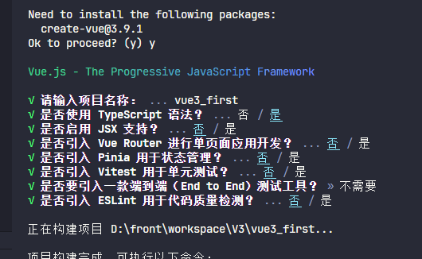
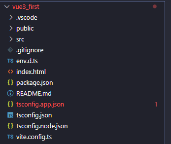
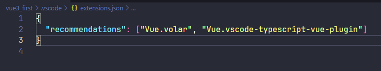

# Vue3学习笔记

> 此笔记使用Vite搭建Vue3、结合TS使用

## 1、使用Vite创建Vue3工程

对node的版本有要求，好像是node>18

```shell
npm create vite@latest
```

后面的选项就看个人需求了



这样vite就给你创建了一个<mark>默认的Vue3模版</mark>

## 2、默认Vue3模版介绍





- .vscode 文件夹：表示为vscode默认安装两个插件
- public 文件夹：项目的静态文件夹目录
- src 文件夹：就是我们写源代码的地方
- .gitignore：git的忽略文件
- env.d.ts：为ts声明不认识的文件，比如jpg，css等后缀名文件
- index.html：程序的入口文件
- tsconfig开头文件：所有关于ts的配置
- vite.config.ts：vite的配置，也是整个项目的配置

## 3、setup语法

首先要清晰的明白<mark>setup是一个函数</mark>，与<mark>Vue2中的data、methods、watch是同级的</mark>

1、setup里面可以写的内容跟js一样，<mark>直接声明变量和方法</mark>

```vue
<template>
    <div>{{name}}</div>
</template>
<script lang="ts">
    export default {
        name:'Person',
        setup(){
            let name = 'zhangsan'
            return {name}
        }
    }
</script>
```

2、这里setup<mark>返回了一个对象</mark>，<mark>其实也可以返回一个函数</mark>，我们称这个函数为<mark>渲染函数</mark>，因为返回的函数内容会直接呈现在页面上，这个时候你写的template和script里面的数据都没有用了。

```vue
<template>
    <div>{{ name }}</div>
</template>
<script lang="ts">
    export default {
        name:'Person',
        setup(){
            let name = 'zhangsan'
            return function(){
                return "hh"
            }
        }
    }
</script>
```

3、setup生命周期甚至在beforeCreate之前

```vue
<template>
    <div>{{ name }}</div>
</template>
<script lang="ts">
    export default {
        name:'Person',
        beforeCreate() {
            console.log('beforeCreate')
        },
        setup(){
            console.log('setup')
            let name = 'zhangsan'
            return {name}
        }
    }
</script>
// 控制台打印
// setup
// beforeCreate
```

总结：

- **setup是一个函数，与vue2中的data、methods同级**
- **setup可以返回一个对象（对象可以在模版中使用），也可以返回函数（渲染函数）**
- **setup中没有this指向**
- **setup生命周期甚至在beforeCreated之前，所以当setup与data同时存在时，data能读取到setup的数据，但是setup不能读取data里面的数据**

## 4、setup语法糖

原来的setup中，我们必须写在export default中，还必须写return 返回值，那有没有简便的写法呢，有了，就是setup的语法糖

```vue
<template>
    <div>{{ name }}</div>
</template>
<script lang="ts">
    export default {
        name:'Person',
    }
</script>
<script lang="ts" setup>
    let name = "zhangsan"
</script>
```

<mark>在script标签内直接写上setup</mark>，就相当于原来setup函数中写的内容，他会自动给你return返回值。

但是这样有个缺点，就是组件的名字name，还必须另外写一个script标签，当然这里有一些解决办法

1. **就是像上方代码一样，写两个script标签**
2. **也可以直接不写组件的name，那么默认组件的文件名就是它的name**
3. **利用vite-plugin-vue-setup-extend插件实现**

下面讲解第三种方式如何实现：

1、首先安装依赖：

```shell
npm i vite-plugin-vue-setup-extend -D
```

2、配置vite文件，引入这个插件，并调用

```shell
import { fileURLToPath, URL } from 'node:url'

import { defineConfig } from 'vite'
import vue from '@vitejs/plugin-vue'
import vueSetupExtend from 'vite-plugin-vue-setup-extend'

// https://vitejs.dev/config/
export default defineConfig({
  plugins: [
    vue(),
    vueSetupExtend()
  ],
  resolve: {
    alias: {
      '@': fileURLToPath(new URL('./src', import.meta.url))
    }
  }
})
```

3、如何使用，直接在script标签上写name

```vue
<template>
    <div>{{ name }}</div>
</template>
<script lang="ts" setup name="Person1234">
    let name = "zhangsan"
</script>
```

## 5、ref函数

在原来的数据中，直接在setup中return对象的数据是<mark>不具备响应式的</mark>

那如何实现呢？看下方代码

```vue
<template>
  <div id="app">
    <div id="textContainer">
      {{ message }}
    </div>
    <button @click="changeText">修改文本</button>
  </div>
</template>

<script setup>
import { ref } from 'vue';

// 使用 ref 创建一个响应式数据
const message = ref('hello, world!');

// 定义方法
const changeText = () => {
  message.value = '你好，中国！';
};
</script>

<style scoped>
#textContainer {
  font-weight: bold;
}
</style>
```

我们行行来解读

```js
import { ref } from 'vue';

// 使用 ref 创建一个响应式数据
const message = ref('hello, world!');
```

这里引入了ref响应函数，并用ref声明一个初始值为”**hello, world!**“的变量，这样，当页面启动的时候，{{}}双大括号会读取里面变量对应的初始值，这里读取的变量为message，它对应的初始值就是”**hello, world!**“。

```js
// 定义方法
const changeText = () => {
  message.value = '你好，中国！';
};
```

这里声明了一个方法，通过点击按钮触发方法，会改变message得值为**你好，中国！**，然后{{}}会显示message变量最新的值，然后显示为**你好，中国！。**

这里就是我们vue响应式的好处，我们一旦声明了一个ref响应式变量，只要这个变量的值一遍，对应页面的值就自动变更了，不用再调用document等js原生方法，是不是超级简洁和方便！

> 总结一下：
>
> - 使用ref函数将你的变量包装起来，就能做到响应式
> - 使用ref包装的变量如果想在setup中使用，必须通过变量.value才能获取到值
> - 在template模版中，不用.value，因为vue会自动给你加上.value

## 6、reactive函数

### 语法

```js
// 引入reactive
import { reactive } from 'vue';
// 声明响应式对象reactive
const reactiveObject = reactive({ /* 对象属性 */ });
```

### 示例

```vue
<template>
  <div>
    <p>Count is: {{ myObject.count }}</p>
    <button @click="increment">增加</button>
  </div>
</template>

<script setup>
import { reactive } from 'vue';

// 使用 reactive 创建一个包含响应式数据的对象
const myObject = reactive({
  count: 0
});

// 定义方法
const increment = () => {
  myObject.count++;
};
</script>
```

## 7、ref函数与reactice函数的区别

