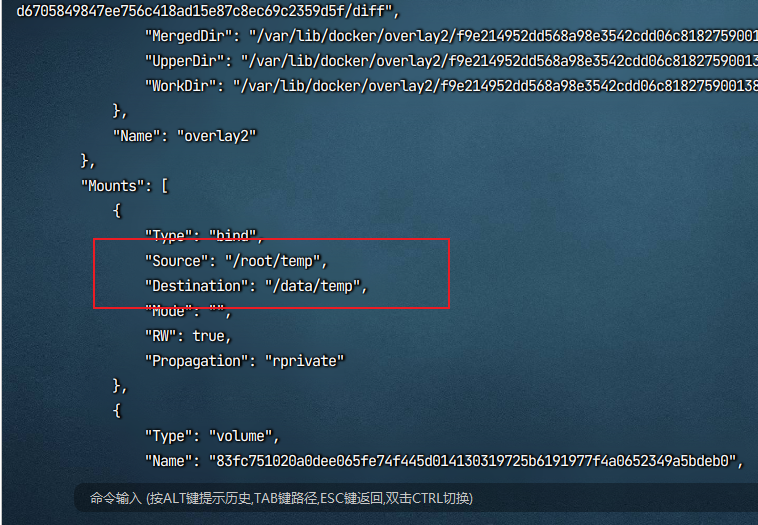
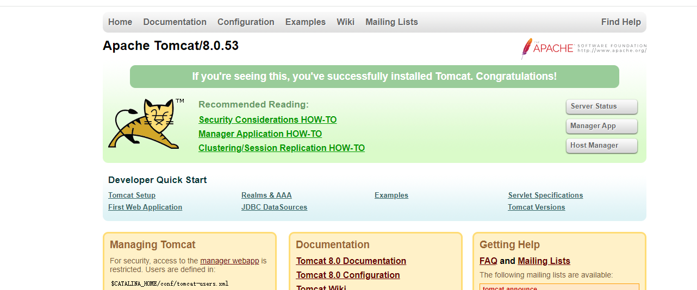

# Docker基础

## 1、简介

Docker是一个开源的容器化平台，可帮助开发者轻松地创建、部署和运行应用程序。Docker使开发人员能够在一个独立的容器中打包应用程序及其依赖项，这样他们就可以轻松地将应用程序移植到任何其他环境中。

使用Docker的主要优势：

便于部署：由于Docker容器可以在任何支持Docker的平台上运行，因此应用程序可以轻松地在不同的环境中部署和运行。
隔离性：Docker容器提供了隔离的运行环境，使得应用程序可以在独立的环境中运行，从而避免了依赖冲突和其他问题。
可移植性：Docker容器可以轻松地从一个平台移植到另一个平台，从而使应用程序在不同的平台上运行变得更加容易。
安全性：Docker容器提供了安全性隔离，使得应用程序和它的依赖项可以在受保护的环境中运行，从而减少了潜在的安全风险。

[官网](https://docker.com)

## 2、安装Docker

Docker支持以下的CentOS版本：

- CentOS 7 (64-bit)
- CentOS 6.5 (64-bit) 或更高的版本

> 目前，CentOS 仅发行版本中的内核支持 Docker。
>
> Docker 运行在 CentOS 7 上，要求系统为64位、系统内核版本为 3.10 以上。
>
> Docker 运行在 CentOS-6.5 或更高的版本的 CentOS 上，要求系统为64位、系统内核版本为 2.6.32-431 或者更高版本。

### 2.1 首先 卸载以前不同的版本，防止不兼容

```shell
sudo yum remove docker \
                  docker-client \
                  docker-client-latest \
                  docker-common \
                  docker-latest \
                  docker-latest-logrotate \
                  docker-logrotate \
                  docker-engine
```

### 2.2 配置yum的docker仓库

```shell
sudo yum install -y yum-utils
# 国外的地址很慢
sudo yum-config-manager --add-repo https://download.docker.com/linux/centos/docker-ce.repo
# 推荐使用阿里云
sudo yum-config-manager --add-repo http://mirrors.aliyun.com/docker-ce/linux/centos/docker-ce.repo
```

### 2.3 更新软件包索引

```shell
yum makecache fast
```

### 2.4 安装docker

```shell
sudo yum install docker-ce docker-ce-cli containerd.io docker-buildx-plugin docker-compose-plugin
```

### 2.5 启动docker

```shell
sudo systemctl start docker
```

### 2.6 运行Hello-world

```shell
sudo docker run hello-world
```

### 2.7 卸载

```shell
systemctl stop docker
# 先移除yum源
sudo yum remove docker-ce docker-ce-cli containerd.io docker-buildx-plugin docker-compose-plugin docker-ce-rootless-extras
# 删除相关目录
sudo rm -rf /var/lib/docker
sudo rm -rf /var/lib/containerd
```

## 3、镜像命令

```shell
# 列出本地镜像
docker images
# 列出本地全部镜像
docker images -a
# 搜索镜像
docker search 镜像名:版本号
# 拉取镜像
docker pull 镜像名:版本号
# 查看镜像/容器/数据卷所占的空间
docker system df
# 删除镜像
docker rmi [-f] 镜像名/镜像ID
```

## 4、容器命令

```shell
# 启动容器
docker run [-it] 镜像名:版本号 
# 列出本地容器
docker ps
# 列出本地全部容器
docker ps -a
# 启动已停止的容器
docker start 容器ID/容器名
# 重启容器
docker restart 容器ID/容器名
# 停止容器
docker stop 容器ID/容器名
# 强制停止容器
docker kill 容器ID/容器名
# 删除容器
docker rm [-f] 容器ID/容器名
# 从容器内拷贝文件到外部
docker cp 容器ID:容器内路径 目的主机路径
# 导入导出容器
docker export 容器ID > 文件名.tar
cat 文件名.tar | docker import - 镜像用户/镜像名：版本号
```

docker run 时参数:

-it：前台交互式运行

-d：后台守护式运行

--name：给容器取名字

-P：随机指定端口

-p：指定端口映射   -p 8080:8080

**交互式运行**：

```shell
docker run -it -name=redisContainer redis:6.0.8 
```

**当以交互式运行时，如何退出容器**：

- exit，exit退出，容器会停止
- ctrl+p+q退出，容器不停止

 **后台运行**：(**后台运行的前提是，容器内必须有一个前台进程**，否则后台运行会启动失败)

```shell
docker run -d --name=redisContainer redis:6.0.8 -p 6379:6379
```

**进入正在运行的容器**：

```shell
docker exec -it 容器名/容器ID /bin/bash
```

```
docker attach -it 容器名/容器ID /bin/bash
```

两者区别：

**exec**会启动新的进程，即使你exit退出，容器也不会停止

**attach**不会启动新的进程，exit退出，容器会停止

**所以推荐使用exec**

## 5、容器Commit

那之前的容器都是拉取的官方的，我们能不能自己制作image呢，当然是可以的

我们可以在正在运行的容器基础上，添加属于我们自己的东西，然后再容器提交一个新的镜像，那就是属于我们自己的镜像

```shell
docker commit -m="提交信息" -a="作者名" 容器ID 包名/自己取的镜像名:版本号
```

运行这段代码后  docker的本地镜像库就会多一个你打包好的镜像出来

## 6、容器数据卷

容器数据卷：能把容器内的数据 挂载到宿主机上，相当于是同步了一份数据到宿主机上，删除了容器，数据不会丢失

```shell
docker run -it --privileged=true -v /宿主机绝对路径:/容器内目录 镜像名
```

--privileged=true：是增加权限

**查看数据卷是否挂载成功**：

```shell
docker inspect 容器ID/容器名
```

找到Mount节点：



source：就是宿主机路径

destination：就是容器内路径

**容器卷读写规则**：

默认情况下，容器卷的读写规则就是rw，就是容器内的文件与宿主机的文件都是可读可写，双方完全同步。

也就是上面的命令，默认就是下面这条命令

```shell
docker run -it --privileged=true -v /宿主机绝对路径:/容器内目录:rw 镜像名
```

下面可以介绍：容器内部被限制，只能读取不能写

```shell
docker run -it --privileged=true -v /宿主机绝对路径:/容器内目录:ro 镜像名
```

ro：read only（只能读）

**容器卷的继承**：

当启动好一个容器与主机之间有挂载容器卷，可以在启动新容器时，指定新容器的容器卷与已经运行的容器卷一样

```shell
docker run -it --privileged=true --volumes-from 父类 --name='Container2' 镜像名字或容器ID:版本号
```

## 7、常用软件安装

### 7.1 Tomcat 安装

```shell
docker run -d -p 8080:8080 --name mytomcat8 billygoo/tomcat8-jdk8
```

本地找不到镜像，会自动去远程仓库下载

跑起来之后，访问8080端口




### 7.2 Mysql 安装

```shell
docker search mysql
```

```shell
docker pull mysql:5.7
```

```shell
docker run -p 3306:3306 -e MYSQL_ROOT_PASSWORD=123456 -d --name mymysql5.7 mysql:5.7
```

运行上面的命令就运行好了mysql了

**可以下面两条命令进入容器连接**

```shell
# 检查运行情况
docker ps
# 进入mysql容器
docker exec -it mymysql5.7 /bin/bash
# 进入mysql
mysql -uroot -p
```

**然而在实际情况下，我们并不会这么做，因为**

1. mysql会存在数据data，我们需要把数据文件与宿主的文件关联起来，也就是数据卷，防止容器被删之后，数据就会找不到的问题
2. mysql也有配置文件，我们也要把他数据卷出来

```shell
docker run -p 3306:3306 --privileged=true -v /home/zcn/mysql/log:/var/log/mysql -v/home/zcn/mysql/data:/var/lib/mysql -v /home/zcn/mysql/conf:/etc/mysql/conf.d -e MYSQL_ROOT_PASSWORD=123456 -d --name mymysql5.7 mysql:5.7
```

，默认我们的mysql是不支持中文的，所以我们要修改它的配置文件，但是我们前面的命令已经将mysql容器内的配置文件挂载到宿主机了，所以我们可以直接修改宿主机的文件目录 /home/zcn/conf，直接进到这个目录下，什么文件都没有，我们直接新建my.cnf文件

```shell
[client]
default_character_set=utf8
[mysqld]
collation_server = utf8_general_ci
character_set_server = utf8
```

然后，重启mysql容器

```shell
docker restart mymysql5.7
```

### 7.3 Redis 安装

```shell
docker pull redis:6.0.8
```

需要先把redis的配置文件挂载到宿主机内,可以去找redis6.0.8的配置文件

```shell
# 开启密码验证（可选）
requirepass 123

# 允许redis外地连接，需要注释掉绑定的IP
# bind 127.0.0.1

# 关闭保护模式（可选）
protected-mode no

# 注释掉daemonize yes，或者配置成 daemonize no。因为该配置和 docker run中的 -d 参数冲突，会导致容器一直启动失败
daemonize no

# 开启redis数据持久化， （可选）
appendonly yes
```


启动docker容器：（因为要使用自定义的配置文件，所以需要指定容器运行的命令为`redis-server 容器内配置文件路径`）

```shell
docker run -d -p 6379:6379 --name myredis --privileged=true -v /home/zcn/redis/redis.conf:/etc/redis/redis.conf -v /home/zcn/redis/data:/data redis:6.0.8 redis-server /etc/redis/redis.conf
```

## 8、Dockerfile

Dockerfile是用来构建Docker镜像的文本文件，是由一条条构建镜像所需的指令和参数构成的脚本。

构建步骤：


1. 编写Dockerfile文件

2. `docker build`命令构建镜像

3. `docker run`依据镜像运行容器实例


### 构建过程


Dockerfile编写：


- 每条保留字指令都必须为大写字母，且后面要跟随至少一个参数

- 指令按照从上到下顺序执行

- `#`表示注释

- 每条指令都会创建一个新的镜像层并对镜像进行提交


Docker引擎执行Docker的大致流程：


1. docker从基础镜像运行一个容器

2. 执行一条指令并对容器做出修改

3. 执行类似`docker commit`的操作提交一个新的镜像层

4. docker再基于刚提交的镜像运行一个新容器

5. 执行Dockerfile中的下一条指令，直到所有指令都执行完成


### Dockerfile保留字

#### FROM


基础镜像，当前新镜像是基于哪个镜像的，指定一个已经存在的镜像作为模板。Dockerfile第一条必须是`FROM`


```dockerfile
# FROM 镜像名
FROM hub.c.163.com/library/tomcat
```


#### MAINTAINER


镜像维护者的姓名和邮箱地址


```dockerfile
# 非必须
MAINTAINER ZhangSan zs@163.com
```


#### RUN


容器构建时需要运行的命令。


有两种格式：


-  shell格式 

```dockerfile
# 等同于在终端操作的shell命令
# 格式：RUN <命令行命令>
RUN yum -y install vim
```

 

-  exec格式 

```dockerfile
# 格式：RUN ["可执行文件" , "参数1", "参数2"]
RUN ["./test.php", "dev", "offline"]  # 等价于 RUN ./test.php dev offline
```

 


`RUN`是在`docker build`时运行


#### EXPOSE


当前容器对外暴露出的端口。


```dockerfile
# EXPOSE 要暴露的端口
# EXPOSE <port>[/<protocol] ....
EXPOSE 3306 33060
```


#### WORKDIR


指定在创建容器后， 终端默认登录进来的工作目录。


```dockerfile
ENV CATALINA_HOME /usr/local/tomcat
WORKDIR $CATALINA_HOME
```


#### USER


指定该镜像以什么样的用户去执行，如果不指定，默认是`root`。（一般不修改该配置）


```dockerfile
# USER <user>[:<group>]
USER patrick
```


#### ENV


用来在构建镜像过程中设置环境变量。


这个环境变量可以在后续的任何`RUN`指令或其他指令中使用


```dockerfile
# 格式 ENV 环境变量名 环境变量值
# 或者 ENV 环境变量名=值
ENV MY_PATH /usr/mytest

# 使用环境变量
WORKDIR $MY_PATH
```


#### VOLUME


容器数据卷，用于数据保存和持久化工作。类似于 `docker run` 的`-v`参数。


```dockerfile
# VOLUME 挂载点
# 挂载点可以是一个路径，也可以是数组（数组中的每一项必须用双引号）
VOLUME /var/lib/mysql
```


#### ADD


将宿主机目录下（或远程文件）的文件拷贝进镜像，且会自动处理URL和解压tar压缩包。


#### COPY


类似`ADD`，拷贝文件和目录到镜像中。


将从构建上下文目录中`<源路径>`的文件目录复制到新的一层镜像内的`<目标路径>`位置。


```dockerfile
COPY src dest
COPY ["src", "dest"]
# <src源路径>：源文件或者源目录
# <dest目标路径>：容器内的指定路径，该路径不用事先建好。如果不存在会自动创建
```


#### CMD


指定容器启动后要干的事情。


有两种格式：


-  shell格式 

```dockerfile
# CMD <命令>
CMD echo "hello world"
```

 

-  exec格式 

```dockerfile
# CMD ["可执行文件", "参数1", "参数2" ...]
CMD ["catalina.sh", "run"]
```

 

-  参数列表格式 

```dockerfile
# CMD ["参数1", "参数2" ....]，与ENTRYPOINT指令配合使用
```

 


Dockerfile中如果出现多个`CMD`指令，只有最后一个生效。`CMD`会被`docker run`之后的参数替换。


例如，对于tomcat镜像，执行以下命令会有不同的效果：


```shell
# 因为tomcat的Dockerfile中指定了 CMD ["catalina.sh", "run"]
# 所以直接docker run 时，容器启动后会自动执行 catalina.sh run
docker run -it -p 8080:8080 tomcat

# 指定容器启动后执行 /bin/bash
# 此时指定的/bin/bash会覆盖掉Dockerfile中指定的 CMD ["catalina.sh", "run"]
docker run -it -p 8080:8080 tomcat /bin/bash
```


`CMD`是在`docker run`时运行，而 `RUN`是在`docker build`时运行。


#### ENTRYPOINT


用来指定一个容器启动时要运行的命令。


类似于`CMD`命令，但是`ENTRYPOINT`不会被`docker run`后面的命令覆盖，这些命令参数会被当做参数送给`ENTRYPOINT`指令指定的程序。


`ENTRYPOINT`可以和`CMD`一起用，一般是可变参数才会使用`CMD`，这里的`CMD`等于是在给`ENTRYPOINT`传参。


当指定了`ENTRYPOINT`后，`CMD`的含义就发生了变化，不再是直接运行期命令，而是将`CMD`的内容作为参数传递给`ENTRYPOINT`指令，它们两个组合会变成 `<ENTRYPOINT> "<CMD>"`。


例如：


```dockerfile
FROM nginx

ENTRYPOINT ["nginx", "-c"]  # 定参
CMD ["/etc/nginx/nginx.conf"] # 变参
```


对于此Dockerfile，构建成镜像 `nginx:test`后，如果执行；


- `docker run nginx test`，则容器启动后，会执行 `nginx -c /etc/nginx/nginx.conf`

- `docker run nginx:test /app/nginx/new.conf`，则容器启动后，会执行 `nginx -c /app/nginx/new.conf`


### 需求练习

构建一个镜像，自带centos7+vim+ifconfig+jdk8


