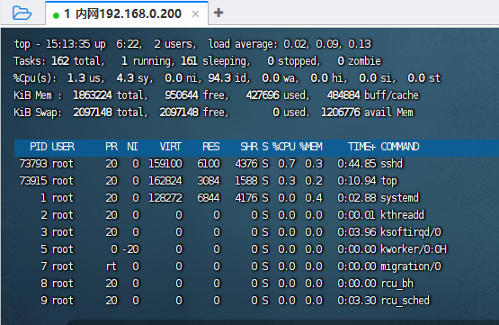

# Linux基础

## 1、介绍

Linux是一套免费使用和自由传播的类Unix操作系统，是一个多用户、多任务、支持多线程和多CPU的操作系统。它能运行主要的UNIX工具软件、应用程序和网络协议。它支持32位和64位硬件。Linux继承了Unix以网络为核心的设计思想，是一个性能稳定的多用户网络操作系统。

说的简单点，它就是一个操作系统

## 2、Linux目录结构

Linux没有盘符概念，只有一个根目录/，所有文件都在它下面

## 3、基础命令

Linux命令的通用格式

```shell
command [-options] [parameter]
```

command：命令本身

-options：可选选项，控制命令细节

parameter：可选参数，控制命令的指向目标

### 3.1 ls

```shell
ls [-a -l -h] [Linux路径]
```

ls：平铺列出当前目录下的所有子文件夹与子文件【简单信息】

-a：可以展示出隐藏文件，比如以.开头的文件夹

-l：以列表的形式展示内容，可以展示更多细节

-h：能够显示文件所占用的大小，通常与-l搭配使用，以更加人性化的方式显示文件的大小单位

### 3.2 cd、pwd

```shell
cd [Linux路径]
```

除了root用户外，其他用户默认进入命令行时，会在用户的home目录下

pwd：显示当前所在的目录

### 3.3 mkdir

```shell
mkdir [-p] Linux路径
```

mkdir：创建新的目录

-p：表示自动创建不存在的父级目录

### 3.4 touch、cat、more

```shell
touch Linux路径
```

touch：创建一个文件

```shell
cat Linux路径
```

cat：表示查看文件的内容，只能查看，不能编辑

```shell
more Linux路径
```

more：也是表示查看文件的内容，more支持翻页，而cat是直接将内容全部展示出来。more在查看过程中，通过空格翻页，通过q退出查看

### 3.5 cp、mv、rm

```shell
cp [-r] Linux路径 Linux路径
```

cp：可以用于复制文件或者文件夹

-r：在复制文件夹的时候可以使用，表示递归复制文件夹里面的内容

参数一：Linux路径：表示被复制的文件夹或者文件

参数二：Linux路径：表示要复制到的地方

```shell
mv Linux路径 Linux路径
```

参数一：Linux路径：表示被移动的文件夹或文件

参数二：Linux路径：表示要移动的地方，如果目标不存在，则进行改名

```shell
rm [-r -f] 参数1 参数2 参数3 ..... 参数N
```

rm：用于删除文件夹或者文件

-r：表示递归删除，同样适用于文件夹

-f：表示force，强制删除（不会弹出提示信息）

参数1 参数2 参数3 ..... 参数N：表示要删除的文件或者文件夹路径，用空格隔开

### 3.6 which、find

```shell
which Linux路径
```

其实我们所学习的Linux命令，都是一个个二进制可执行程序，就像Window的exe文件一样。

我们可以通过which命令，查看我们所使用的一系列的命令的程序文件放在哪里


```shell
find 起始路径 -name "被查找的文件名"
```

被查找的文件名支持使用*通配符来做模糊查询

```shell
find 起始路径 -size +|-n[KMG]
```

+、-：表示大于小于

n：表示大小数字

KMG：表示大小单位 


### 3.7 grep、wc、管道符

```shell
grep [-n] 关键字 文件路径
```

grep：从文件中通过关键字过滤文件行

-n：表示匹配到的行的行号

参数关键字：必填，表示要过滤的关键字，带有空格或者其他特殊符号，建议使用“”双引号包裹起来

参数文件路径：必填，表示要过滤的文件路径

```shell
wc [-c -m -l -w] 文件路径
```

可以通过wc命令统计文件的函数、单词数量等

-c：统计bytes数量

-m：统计字符的数量

-l：统计函数

-w：统计单词数量

参数，文件路径：表示被统计的文件

```shell
|
```

一个特殊符号|：表示管道符

**管道符的含义是将左边命令的结果，作为右边命令的输入**

### 3.8 echo、tail 、重定向

```shell
echo ""
```

echo：用于在命令行输出字符，如果你想要输出的命令被执行，那你需要用``号包裹起来

```shell
> >>
```

`>` ：表示将左侧的内容覆盖写入到右侧指定的文件中

`>>`：表示将左侧的内容追加写入到右侧指定的文件中


```shell
tail [-f -num] Linux路径
```

tail：查看文件尾部的内容，跟踪文件的内容

-f：表示持续跟踪

-num：表示查看尾部多少行，默认10行


### 3.9、vi和vim编辑器

区别：vi/vim 是 Linux 系统内置的不可或缺的文本编辑命令，VIM 是 vi 的加强版本，兼容 vi 的所有指令，不仅能编辑文本，而且还具有 shell 程序编辑的功能，可以不同颜色的字体来辨别语法的正确性，极大方便了程序的设计和编辑性。

#### 2.1 三种常见模式

##### 2.1.1 正常模式

刚刚启动 vi/vim，则进入一般模式，可以移动光标、复制粘贴、删除字符等。此状态下键盘输入会被识别为命令操作，常用到的包括 i(切换到插入模式)，x(删除当前光标所在字符)，:(切换到命令行模式)。

##### 2.1.2 插入模式

在一般模式下按下键盘【i, I, o, O, a, A】进入插入模式，屏幕的左下方会出现【--INSERT--】的字样，表示当前模式下，用户可以编辑修改文本的内容。按下【Esc】则退出编辑模式。

##### 2.1.3 命令行模式

在一般模式下按下键盘【: / ?】任意一个，光标移动到最下面一行，进入末行模式。可以查找数据、替换、可保存文件、退出 vi、显示行号等操作。

**常见操作**：

## 4、用户和用户组

### 4.1 root用户拥有最大的系统权限

```shell
su - 用户名
```

su：表示切换用户

切换完用户后可以使用exit退出用户

```shell
sudo 其他命令
```

sudo：可以为后面的命令临时赋予root权限

但是不是所有用户都能执行sudo，我们需要用root用户对这个普通用户配置sudo认证

### 4.2 Linux系统中可以配置多个用户、多个用户组、一个用户可以加入多个用户组

Linux中关于权限的管控级别有2个级别，分别是：

- 针对用户的权限控制
- 针对用户组的权限控制

**关于用户组**：

以下命令都需要root用户执行：

创建用户组：

```shell
groupadd 用户组名
```

删除用户组：

```shell
groupdel 用户组名
```

**关于用户**：

以下命令都需要root用户执行：

创建用户：

```shell
useradd [-g -d] 用户名
```

- -g：表示指定用户所在的组，不指定-g，会创建同名组并自动加入，指定-g需要组已经存在，如已存在同名组，必须使用-g
- -d：表示指定用户HOME目录，不指定，HOME目录默认在：/home/用户名

删除用户：

```shell
userdel [-r] 用户名
```

- -r：表示删除用户的HOME目录，不使用-r，删除用户时，HOME目录保留

查看用户所属组

```shell
id [用户名]
```

修改用户所属组

```shell
usermod -aG 用户组 用户名
```

将指定的用户 加入到指定的用户组

### 4.3 getent

查看当前系统一共有哪些用户和用户组

查看用户：

```shell
getent passwd
```

查看用户组：

```shell
getent group
```

## 5、权限管控

### 5.1 查看权限

```powershell
ll 或者ls -l
```

权限细节一共10个槽位


r：表示读权限

w：表示写权限

x：表示执行权限

针对文件和文件夹，rwx的含义有稍微差别

r：

- 对于文件来说，表示可以查看文件内容
- 对于文件夹来说，可以查看文件夹内容，如ls命令

w：

- 对于文件来说，表示可以修改此内容
- 对于文件夹来说，表示可以再文件夹内：创建、删除、改名等操作

x：

- 对于文件来说，可以将文件作为程序执行

- 对于文件夹来说，表示可以更改工作目录到此文件夹，比如cd进入操作


### 5.2 修改权限

**修改文件或者文件夹的权限**：

```shell
chmod [-R] 权限 文件或者文件夹
```

注意：**只有文件或者文件夹的所属用户或者root用户才可以修改**

选项：-R ： 表示对文件夹内的全部内容应用同样的操作

示例：

​	chmod u=rwx,g=rx,o=x hello.txt ,将文件权限修改为：rwxr-x--x

- 其中，u表示user所属用户的权限，g表示group组权限，o表示other其他用户权限

​    chmod -R u=rwx,g=rx,o=x test ，将文件夹test以及文件夹内的全部权限修改为rwxr-x--x

但是，由于每次修改都要写一堆u,g,o，太多了，官方建议可以修改数字，**快捷写法：chmod 751 hello.txt**

在数字表示法中，**r记为4，w记为2，x记为1**，可以有：

- 0：为任何权限，即---
- 1：仅有x权限，即--x
- 2：仅有w权限，即-w-
- 3：表示w，x权限，即-wx
- 4：仅有r权限，即r--
- 5：有r和x权限，即r-x
- 6：有r和w权限，即rw-
- 7：有全部权限，即rwx

所以751：表示的是u=rwx，g=r-x，o=x


**修改文件或者文件夹的所属用户和用户组**

```shell
chown [-R] [用户][:][用户组] 文件或文件夹
```

注意：**普通用户无法修改所属其他用户或组，所以此命令值适用于root用户执行**


## 6、软件安装

**安装方式一**：去官网下载相应的linux安装包

**安装方式二**：Linux命令行内的“应用商店”，yum 命令安装软件

yum：**RPM包的软件管理器，用于自动化安装配置Linux软件，并可以自动解决依赖问题**

```powershell
yum [-y] [install | remove | search] 软件名称 
```

选项：-y：表示自动确认，无需手动确认安装或卸载过程

install ：安装

remove：卸载

search：搜索

注意：

- yum命令需要root权限，可以使用su切换root，或者sudo提权
- yum命令需要联网

**上面的yum命令是Centos系统所执行的，在Ubuntu中，要使用apt命令**

## 7、systemctl命令

Linux系统由很多内置软件或者第三方软件，均可使用systemctl命令控制启动、停止。但是有些第三方软件并没有自动集成到systemctl中，需要自己手动添加。

能够被systemctl管理的软件，一般也称之为：**服务**

```powershell
systemctl start | stop | status | enable | disable 服务名
```

start：启动

stop：停止

status：查看状态

enable：开机自动启动

disable：关闭开机自动启动

系统内置服务：

NetworkManager，主网络服务

network，副网络服务

firewalld，防火墙服务

sshd，ssh服务（远程登录服务）

## 8、软链接

在Liunx中创建软链接，可以将文件、文件夹链接到其他位置上。类似于window系统中的快捷方式。

```shell
ln -s 参数1 参数2
```

选项-s：表示创建软链接

参数1：被链接的文件或者文件夹

参数2：表示要链接的目的地


## 9、日期和时区

查看日期

```shell
date [-d] [+格式化字符串]
```

选项：-d：一般用于日期计算。


校准时间可以利用**ntp程序**

## 10、网络

### 10.1 ping

ping命令，可以检查指定的网络服务器是否可以可联通的状态

```shell
ping [-c num] ip或主机名
```

选项：-c，检查的次数，不使用-c选项，默认无限次数检查

参数：ip或主机名，被检查的服务器的ip地址或主机名地址

示例：

```shell
ping -c 4 www.baidu.com
```

检查baidu.com是否可以联通，并且检查4次

### 10.2 wget

wget是一个非交互式的文件下载器，可以在命令行内下载网络文件

```shell
wget [-b] url
```

选项：-b：表示后台下载，会将日志写入到当前工作目录的wget-log文件中

参数：url：表示下载链接

示例：

```shell
wget -b http://archive.apache.org/dist/hadoop/common/hadoop-3.3.0/hadoop-3.3.0.tar.gz
```

### 10.3 curl

curl可以发送http网络请求，可用于：下载文件、获取信息等

```shell
curl [-O] url
```

选项：-O：用于下载文件时，当url是下载文件的链接时，可以使用此项来保存文件

参数：url，要发起请求的网络地址

## 11、端口

可以通过netstat命令，查看端口占用情况

```shell
netstat -anp | grep 6000
```

netstat -anp | grep 端口号，安装netstat：yum -y install net-tools


可以看到6000端口被进程7437占用

## 12、进程

```shell
ps -ef
```

查看系统所有的进程

可以携带 | grep 过滤一些数据

```shell
ps -ef | grep java
```

就可以过滤java相关的进程，当然最后一条是不算的，它表示这个命令本身，因为命令本身也带了java


### 关闭进程

```shell
kill [-9] 进程号
```

结束进程，-9表示：强制结束进程

## 13、查看系统状态

```shell
top
```

top命令查看Linux系统的运行状态，相当于window的任务管理器，可以查看cpu、内存等的运行情况




第一行：


`top`：命令名称，`15:13:35`表示当前时间，`up 6:22` 表示已经启动6分钟了，`2 user` 表示2个用户

第二行：


Task：一共162个进程，一个正在运行，161个正在睡眠，0个停止，0个僵尸

第三行：


Cpu使用率

第四五行：


Kib Mem：物理内存，total：总量字节，free：空闲 used：已使用   buff/cache 占用

Kib Swap：虚拟内存，total：总量字节，free：空闲 used：已使用   buff/cache 占用

## 14、环境变量

环境变量就是一组信息记录，KeyValue形式，用于操作系统运行的时候记录关键信息

env 命令可以查看系统的全部环境变量

通过$符号，可以取出环境变量的值

如何修改环境变量：

​	修改/etc/profile 文件，配置完成后使用source命令使其生效

## 15、解压和压缩

Linux系统中，压缩格式一般分为2种，

- .tar 称为tarball，归档文件。
- .gz，也常见.tar.gz,gzip格式压缩文件。

针对两种格式均可使用 tar命令对其压缩和解压的操作

```shell
tar [-c -v -x -f -z -C] 参数1 参数2 参数..... 参数N
```

-c：创建压缩文件，用于压缩模式

-v：显示压缩、解压过程，用于查看进度

-x：解压模式

-f：要创建的文件，或要解压的文件 ， -f选项必须在所有选项位置处于最后一个

-z：gzip模式，不使用-z 就是普通的tarball模式

-C：选择解压的目的地，用于解压模式

示例：

```shell
tar -cvf test.tar 1.txt 2.txt
```

将1.txt 2.txt 使用普通模式压缩成test.tar

示例：

```shell
tar -zcvf test.tar.gz 1.txt 2.txt
```

将1.txt 2.txt 压缩到test.tar.gz文件中

示例：

```shell
tar -xvf test.tar -C /home/www/test
```

将test.tar文件解压到  /home/www/test 目录下

示例：

```shell
tar -zxvf test.tar.gz -C /home/www/test
```

将文件test.tar.gz 解压到 /home/www/test 目录下

## 16、实战


