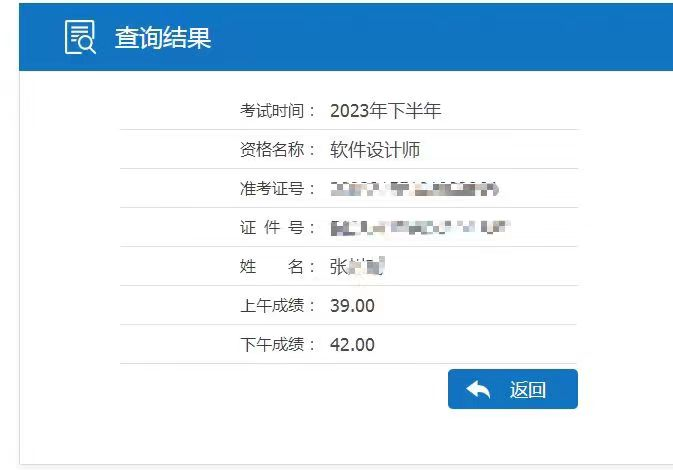

# 博主软考之旅

>  zst的B站账号：[https://space.bilibili.com/91286799](https://space.bilibili.com/91286799) （大家多多关注，真是大好人！）
>
>  zst学习路线地址：[https://www.bilibili.com/read/cv18526892/](https://www.bilibili.com/read/cv18526892/)
>
>  zst学习资料地址：
>
>  ​	阿里云盘：[https://www.aliyundrive.com/s/dMmNyUXMYgU](https://www.aliyundrive.com/s/dMmNyUXMYgU ) 
>
>  ​	百度网盘：[https://pan.baidu.com/s/1URd4tl_iFjAMZxgxcHqAFg?pwd=2022](https://pan.baidu.com/s/1URd4tl_iFjAMZxgxcHqAFg?pwd=2022)
>
>  ​	百度网盘提取码：2022

## 祝愿

**祝愿看到这里的朋友都能一把过！！！ 大家加油！！！**

## 关于软考

最开始，我在大学里其实已经听说了软考，但是由于大学里，大家dddd，每天摆烂学习，再加上周围宿舍也都是这样，整个大学并没有参加什么实质性证书，可能就是考过一些蓝桥杯，1+Xweb证书，但是这些证书在工作中没有鸟用。

或许是我在招聘网站上经常看到招聘要求：软考证书、PMP证书优先，也在工作中听到同事讨论一些关于软考的作用，还有之前公司投标的时候，老板出来问我们软考证书有没有。

为此，我还专门在网上搜索了关于软考的知识，关于软考的作用我之前也发布了一篇博客[https://blog.wazicode.top/posts/b6d9fe5b.html](https://blog.wazicode.top/posts/b6d9fe5b.html) 再加上学习软考也可以补充自己的基础知识，也想着对简历会有一定的镀金，以后跳槽更有竞争力了。别的不知道，证书肯定有比没有好，于是再了解到软考的科目之后，我决定报考 软考中级证书：<mark>软件设计师</mark>。

## 开始

在今年我开始准备报考软件设计师，也就是2023年11月份。上下班的缘故，回来就不想动。学了一些，但是没学完。

## 考试过程

考试过程可以看看这篇文章  [https://blog.wazicode.top/posts/9286fa.html](https://blog.wazicode.top/posts/9286fa.html)

## 结果

2023.12.7号 出成绩了 本来我还报有一些侥幸感觉能过，查了分数发现是我错了 :sob:

明年我会继续的，加油！！！ 后续持续更新！